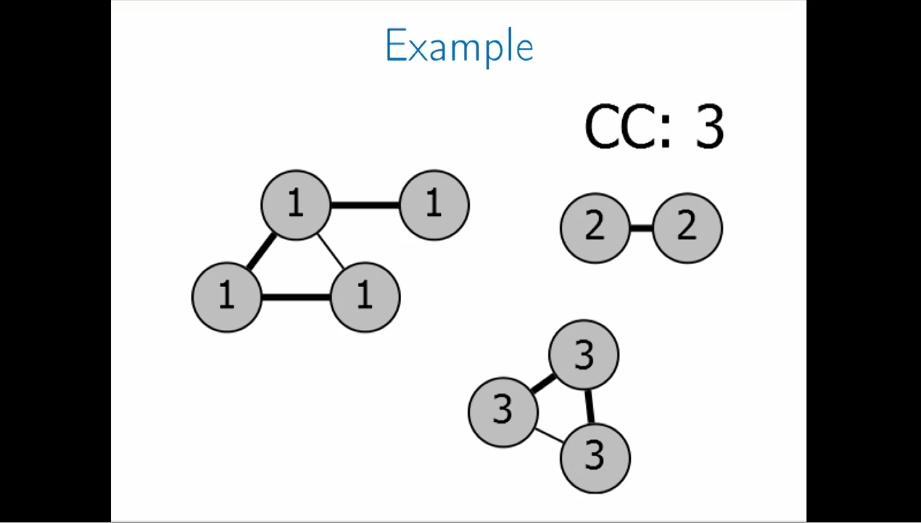
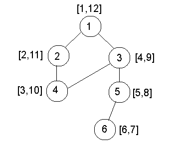

## Discover graph
Link khóa học: https://www.coursera.org/learn/algorithms-on-graphs/home/welcome

**Các cụm từ quan trọng**
```
vertex: đỉnh
V: danh sách đỉnh
edge: cạnh
E: danh sách cạnh
```

Thuật toán duyệt đồ thị từ 1 node
```
Explore(V){
    visited(v) <- true
    for (v, w) in E:
        if not visited(w):
            Explore(w)
}
```
```python
# Duyệt đồ thị với mã thật
vertice_num, edge_num = [int(i) for i in input().split(' ')]
edges = []
for _ in range(edge_num):
    edges.append([int(v) for v in input().split(' ')])

v1, v2 = [int(i) for i in input().split(' ')]

visited = [False] * (vertice_num + 1)
def explore(v):
    global visited
    if visited[v]:
        return
    else:
        visited[v] = True
        for edge in edges:
            if edge[0] == v or edge[1] == v:
                if edge[0] == v:
                    explore(edge[1])
                else:
                    explore(edge[0])

explore(v1)
if visited[v2]:
    print(1)
else:
    print(0)
```
Từ node chính duyệt qua các node kề nó (neighbour, adjacent)

(v, w): danh sách các cạnh thuộc E (tập hợp cạnh Edges)

```
<!-- DFS -->
for all v in V: mark v unvisited
for v in V:
    if not visited(v):
        Explore(v) # hàm Explore() bên trên
```
Thuật toán DFS duyệt đồ thị từ 1 đỉnh sau đó từ đỉnh đó sẽ duyệt các đỉnh đi tới đc từ đỉnh đó -> đếm số số connected component (các mảnh tách rời) của đồ thị

### Connected components (CC)
Sửa lại hàm DFS() bên trên với 1 tăng connected components lên 1
```
for all v in V: mark v unvisited
CCnum = 0 # ban đầu số thành phần sẽ được gán là 0
for v in V:
    if not visited(v):
        Explore(v) # duyệt qua mọi đỉnh trong 1 connected component. Các đỉnh đó sẽ đánh dấu visited và ko quay lại vào if này nữa. các đỉnh thuộc connect component khác sẽ vào đây -> CCnum cộng thêm 1
        CCnum +=1
```

Sửa lại hàm Explore()
```
Explore(V){
    visited(v) <- true
    CCnum(v) <- cc # tại đây đánh nhãn cho đỉnh đó thuộc CC số mấy
    for (v, w) in E:
        if not visited(w):
            Explore(w)
}
```


## Previsit and postvisit
> Đánh dấu thứ tự (thời điểm qua đỉnh). Pre: đi qua lần đầu, post: quay lại.
2 hàm này dùng chung 1 biến clock. Mỗi lần đi qua đỉnh thì gán clock vào cho đỉnh và tăng lên 1

```
**************Explore(v)**************
visited(v) <- true
previsit(v)
for (v,w) in E:
    if not visited(w):
        Explore(w)
postvisit(v)
-----------
**************Previsit(v) & Postvisit(v)**************
global clock
v[pre/post] = clock
clock +=1
```


Trong hình này thể hiện thứ tự duyệt đồ thị