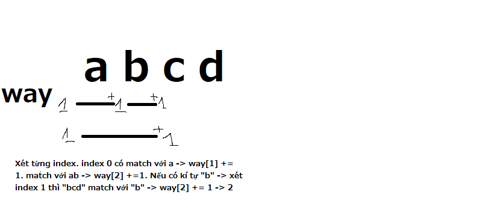

# Recursion và dynamic programming

## Sơ lược
`Recursion` và `dp` là 2 thuật toán sử dụng chung 1 cách tính phần tử sau dựa vào phần tử trước. `ans[x] = f(ans[y])`. Trong khi recursion liên tục gọi hàm và tạo ra frame thì dp chỉ dùng 1 vòng lặp.

### Độ phức tạp: 
`Recursion`: độ phức tạp của recursion thường là khá lớn. Do quá trìn gọi đệ quy liên tục sinh ra function frame trong bộ nhớ. Nhiều trường hợp thường sinh ra `TLE, MLE`.
`DP`: độ phức tạp của dp thường chỉ là `O(n)` với n là số phần tử được duyệt.

### Chuyển đổi từ đệ quy sang dp
> dp chuyển sang đệ quy là không cần thiết vì dp thường tốt hơn.

TODO

## Ví dụ

### Ví dụ 1
<details>
    <summary>Word Combinations - Recursion - TLE</summary>

```c++
// https://cses.fi/problemset/task/1731/
#include<bits/stdc++.h>
 
typedef long long ll;
const ll mod = 1e9 + 7;
using namespace std;
 
struct Node{
    char val;
    bool is_leaf;
    vector<Node*> childs;
    Node(char val){
        this->val = val;
    }
    Node* find_child(char val){
        for (auto &n: this->childs){
            if (n->val == val){
                return n;
            }
        }
        return nullptr;
    }
    Node* get_or_create_child(char val){
        // Tìm
        Node* child = find_child(val);
        if (child != nullptr) return child;
        // Tạo mới
        Node* new_child = new Node(val);
        this->childs.push_back(new_child);
        return new_child;
    }
};
 
struct Trie{
    Node root = Node(0); // 0 là root, 'a', 'b' bắt đầu từ 1, 2,...
    Trie(){}
    void insert(string s){
        Node* cur = &root;
        for (auto c: s){
            cur = cur->get_or_create_child(c);
        }
        cur->is_leaf = true;
    }
    void find(string s){
        // TODO
    }
    int ans = 0;
    void match_word(string word, int index=0){
        if (index >= word.size()) {
            ans++;
            return;
        }
        Node* cur = &root;
        for (int i=index;i<word.size();i++){
            cur = cur->find_child(word[i]);
            if (cur == nullptr) return;
            if (cur->is_leaf){
                match_word(word, i+1);
            }
 
        }
    }
};
 
int main(){
    ios::sync_with_stdio(0); cin.tie(0);
    #ifdef DEBUG
        freopen("inp.txt", "r", stdin);
        freopen("out.txt", "w", stdout);
    #endif
    string s;
    cin >> s;
    int n; cin >> n;
    Trie trie;
    for (int i=0;i<n;i++){
        string x; cin >> x;
        trie.insert(x);
    }
    trie.match_word(s, 0);
    cout << trie.ans;
    dbg("ok");
    cerr << "Time : " << (double)clock() / (double)CLOCKS_PER_SEC << "s\n";
}
```
</details>

<details>
    <summary>Word combinations - DP - Accepted</summary>

```c++
// https://cses.fi/problemset/task/1731/
#include<bits/stdc++.h>
 
typedef long long ll;
const ll mod = 1e9 + 7;
#define ld long double
 
using namespace std;
 
 
#ifdef DEBUG
#include "debug.cpp"
#else
#define dbg(...)
#endif
 
struct Node{
    char val;
    bool is_leaf = false;
    vector<Node*> childs{};
    Node(char val){
        this->val = val;
    }
    Node* find_child(char val){
        for (auto &n: this->childs){
            if (n->val == val){
                return n;
            }
        }
        return nullptr;
    }
    Node* get_or_create_child(char val){
        // Tìm
        Node* child = find_child(val);
        if (child != nullptr) return child;
        // Tạo mới
        Node* new_child = new Node(val);
        this->childs.push_back(new_child);
        return new_child;
    }
};
 
struct Trie{
    Node root = Node(0); // 0 là root, 'a', 'b' bắt đầu từ 1, 2,...
    Trie(){}
    void insert(string s){
        Node* cur = &root;
        for (auto c: s){
            cur = cur->get_or_create_child(c);
        }
        cur->is_leaf = true;
    }
 
    int ans = 0;
    void match_word(string word){
        /* Tại mỗi điểm tính các cái match tại điểm đó - tức là những string nào bắt đầu từ đó được
        */
        vector<ll> way(word.size()+1, 0);
        way[0] = 1;
        for (int i=0;i<word.size();i++){
            // Tìm match tại điểm này
            Node* cur = &root;
            int index = i;
 
            while (true){
                cur = cur->find_child(word[index]);
                if (cur == nullptr) break;
                index++;
                if (cur->is_leaf) {
                    way.at(index) += way.at(i);
                    way[index] %= mod;
                }
            }
        }
        cout << way[word.size()]<<'\n';
    }
};
 
int main(){
    ios::sync_with_stdio(0);
    cin.tie(0);
    #ifdef DEBUG
        freopen("inp.txt", "r", stdin);
        freopen("out.txt", "w", stdout);
    #endif
    string s;
    cin >> s;
    int n; cin >> n;
    Trie trie;
    for (int i=0;i<n;i++){
        string x; cin >> x;
        trie.insert(x);
    }
    trie.match_word(s);
    cerr << "Time : " << (double)clock() / (double)CLOCKS_PER_SEC << "s\n";
}
```
</details>

Bài trên cho 1 string s và 1 tập hợp các string k. Hỏi rằng có bao nhiêu cách kết hợp các string trong k tạo ra s.

Xét ví dụ đơn giản: `s = "abcd" và k = {"ab", "cd"}`

**Dùng đệ quy**: ta thấy nếu s match với 1 phần tử trong k cụ thể là `ab` thì khi đó phần còn lại `cd` sẽ lại được coi như s ban đầu. Khi này `s' = "cd" và k = {"ab", "cd}`. Khi nào `s' = ""` thì tức là có 1 cách để kết hợp các phần tử trong k ra s.

```c++
void match_word(string s, int index=0){
    if (index == s.size()) ans++; // (1)
    if (s match với 1 string trong k gọi là sub){
        match_word(s, index + sub.size()); // khi này s' sẽ bắt đầu từ index + sub.size() và lặp lại cho tới khi gặp móc treo (1)
    }
}
```
**Dùng dp**: tương tự như trên nhưng thay vì gọi đệ quy thì dùng 1 mảng `way` (không nên dùng `dp` như họ hay dùng vì nó mù mờ về nghĩa và làm mất tập trung khi cố để hiểu `dp` là gì trong lúc code). `way` ở đây thể hiện tại điểm đó có bao nhiêu cách đến được.  
Ví dụ: `s = "abcd", k = {"ab", "cd", "a", "b"}`.  
-> way = [1, 0, 0, 0, 0]; 
* s match với "a" tại index=0 -> tại vị trí 1 sẽ có nền là index 0 và way[1] += way[0]. Ở đây là `+=` vì way[i] có thể có nhiều lần cộng. khi này s' = "bcd" và way chỉ số cách tới được đây. way[1] = 1 nghĩa là tới được đây có thể dùng "a".
* s match với b -> way[2] = 1; // "a" + "b"
* s match với "ab" -> way[2] = 2 (1+=1) // "a" + "b" || "ab"


