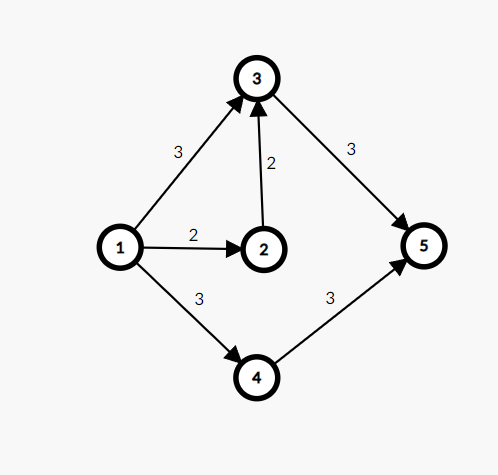
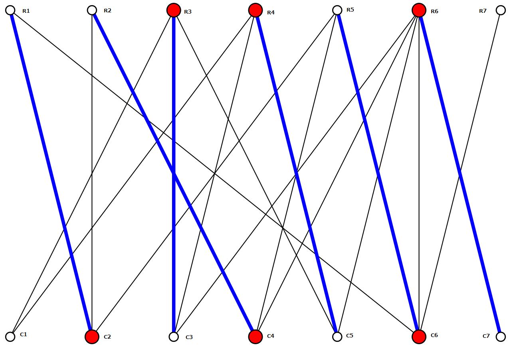

# Max flow on graph
> Sử dụng thuật toán Dinic O(E\*V*V). Do độ phức tạp nên E thường nhỏ (<1000)

Bài toán max flow có khá nhiều cách giải và độ phức tạp cũng khác nhau. Tại đây sử dụng Dinic để giải (1 phần vì các template khác lỗi, hoặc tương đối khó để sử dụng)
## 1 vài khái niệm
* Residual graph: là đồ thị để xử lý thuật toán, đồ thị này là 1 grid N*N và thay đổi trong quá trình xử lý. Toàn bộ quá trình duyệt đều sử dụng graph này (trong thuật toán Dinic, ko dùng tới graph ban đầu)  
	Đặc điểm của residualGraph. Sau khi chạy maxflow thì residualGraph[u][v] sẽ nhỏ đi so với graph[u][v] và residualGraph[v][u] sẽ tăng lên (nhưng ko quan tâm tới [v][u] - nằm trong thuật toán). graph[u][v] - residualGraph[u][v] chính là lượng flow chạy qua uv -> residualGraph[u][v] = 0 nghĩa là uv sử dụng toàn bộ capacity và chính là 1 mincut edge
* Augment path: 1 path từ s->t mà có số dư flow > 0
* Min-cut: là 1 đường cắt các cạnh đồ thị chia nó làm 2 nửa, min-cut value chính là tổng của các cạnh bị cắt (chỉ tính cạnh đi từ Set(s) -> Set(t) không tính cạnh đi ngược hay đi ngang). Mincut set bao gồm các cạnh có flow được sử dụng hết (residualGraph[u][v] = 0)   
	* Tìm min-cut: duyệt BFS() trên residual graph. Xét s, a, b, t. s - điểm đầu, t - điểm cuối, a,b - 2 điểm trong đồ thị. Điều kiện duyệt BFS(u) -> BFS(v) là u->v trên residual graph lớn hơn 0. (=0 nghĩa là nó đã có flow đi qua làm bão hòa. ví dụ ban đầu u->v=10 thì khi dùng 10 trên residual graph sẽ là 0). Khi này nếu uv=0 và trên graph ban đầu có u->v > 0 tức là đây là 1 cạnh bão hòa (saturated edge). Khi xóa bỏ cạnh này sẽ làm cho đồ thị bị cắt (gián đoạn). Xét hình dưới đây 
	Xét việc maxflow dùng cạnh 1->3, 3->5, 1->4, 4->5. 1 tại đây ko thể tới trực tiếp 3, nhưng đi tới 2 sẽ tới 3. 3 không chạm đc 5 -> Edge(3,5) chính là 1 cạnh bão hòa. Tương tự 1->4 là 1 cạnh bão hòa. Vậy min-cut edges sẽ là 3->5 và 1->4.
* Alternating path (path đan xen): 

Xét hình trên ta có :
	* Maxflow = 6
	* Mincut_edges: (R1, C2), (R2, C4), (R3, C3), (R4, C5), (R5, C6), (R6, C7)
	* Từ điểm C1 ta có alternating path là:
		* C1->R3->C3->R4->C5->R6->C7
		* C1->R4->C5->R3->C3->R6->C7
		* C1->... (có tương đối nhiều alternating path)

	Ta có
	* C1->R3: không phải mincut
	* R3->C3: là mincut
	* C3->R4: không phải mincut
	* R4->C5: mincut
	* C5->R6: ko phải mincut
	* R6->C7: mincut
* Minimum cover vertex/node (bipartite graph)  
	Là 1 tập hợp k node sao cho mọi cạnh của đồ thị đều có 1 điểm xuất hiện. Nói cách khác với mọi cạnh u->v thì hoặc u hoặc v phải xuất hiện trong tập hợp này.  
## Thuật toán:
* Tìm max flow: sử dụng Dinic

	Thuật toán dinic chạy hoàn toàn trên residual graph, graph ban đầu giữ nguyên. Residual graph thể hiện flow còn lại trên mỗi cạnh
* Tìm mincut edges:   
	Sau khi dùng Dinic, A->B=3, B->C=2, C->D=4. Từ A->D max flow = 2. Cạnh BC chính là mincut. Khi này trên residualGraph BC=0 (nghĩa là số flow có thể đi qua BC thêm nữa = 0). residualGraph(AB) = 1 (nghĩa là AB chỉ dùng hết 2, còn dư 1).   
	Đơn giản xét `residualGraph[u][v] = 0 && graph[u][v] > 0`.  
	Nhưng AB=3, BC=2, CD=2. thì mincut chỉ tính BC thay vì cả CD và BC. Sử dụng BFS(u). BFS(u) -> BFS(v) với điều kiện là u->v > 0. BFS(A) -> BFS(B). Khi này `vis[B] nhưng !vis[C] và graph[B][C]` thì BC mà mincut_edge  
	Với đồ thị bipartite, RC là 1 mincut khi `residualGraph[R][C] = 0 && graph[R][C] = 1`. 
* Tìm minimum cover vertex/node  
	* Thuật toán: Dinic + Konig theorem
	* Tham khảo: 
		* https://en.wikipedia.org/wiki/K%C5%91nig%27s_theorem_(graph_theory)
		* https://tryalgo.org/en/matching/2016/08/05/konig/?fbclid=IwAR1Z-m7JTMLDiGTufiBtVKo--mq3JrNIdzpO0GueEdu3yUqXo7LGZm0TL5s (có backup tại thư mục backup/graph/maxflow)
	* Chọn các node trên row (left) có cạnh nhưng không thuộc mincut_edge. Từ các node đó duyệt DFS() trên alternating path và đánh dấu lại các điểm đã duyệt. Các node đã duyệt trên col và các node chưa duyệt trên row chính là tập hợp minimum cover vertex
	* Mã giả
	```c++
	set<ll> no_match;
	for (ll r: row) {
		if (hasEdgeFrom(r) && r not in mincut_edge) {
			no_match.insert(r);
		}
	}
	void explore(ll u, ll signal, ll to_row_or_col) {
		if (!vis[u]) vis[u] = true;
		if (signal == 0 && to_row_or_col == 0) {
			// Tìm đỉnh v trên row và uv không phải mincutedge
			explore(v, 1-signal, 1 - to_row_or_col); // 1-singal thể hiện cạnh mincut đan xen với cạnh thường (alternating), 1-to_row_or_col thể hiện đỉnh từ row nối với col rồi đỉnh từ col nối tới row
		}
		if (signal == 1 && to_row_or_col == 0) {
			// Tìm đỉnh v trên row và uv là mincutedge
			explore(v, 1-signal, 1 - to_row_or_col);
		}
		if (signal == 0 && to_row_or_col == 1) {
			// Tìm đỉnh v trên col và uv không phải mincutedge
			explore(v, 1-signal, 1 - to_row_or_col);
		}
		if (signal == 1 && to_row_or_col == 1) {
			// Tìm đỉnh v trên col và uv không phải mincutedge
			explore(v, 1-signal, 1 - to_row_or_col);
		}	
	}
	// DFS()
	for (auto v: no_match){
		explore(v, 0, 1); // xét no_match trên row nên khi duyệt sẽ tới col đầu tiên nên to_row_or_col = 1 (to_row = 0, to_col = 1). signal thể hiện việc tìm cạnh mincut (1) hay cạnh thường (0)
	}
	set<ll> min_cover_nodes;
	for (auto v: column) {
		if (vis_col[v]) ans.insert(v);
	}
	for (auto v: row) {
		if (vis_row[v]) ans.insert(v);
	}
	```
## Các vấn đề liên quan/ Mở rộng

### Bipartite Matching
[CMU Bipartite Matching slide](https://www.cs.cmu.edu/~ckingsf/bioinfo-lectures/matching.pdf)
## Tham khảo

* https://www.youtube.com/watch?v=oHy3ddI9X3o&ab_channel=MITOpenCourseWare
* https://www.youtube.com/watch?v=VYZGlgzr_As&ab_channel=MITOpenCourseWare
## Template
[Max flow dinic template](https://github.com/conlacda/noteforprofessionals/blob/master/language/C%2B%2B/snippet/graph-dinic-max_flow.sublime-snippet)
## Bài giải

<details>
  <summary>CSES Download speed</summary>
  
```c++
// https://cses.fi/problemset/task/1694/
#include <bits/stdc++.h>
 
using namespace std;
 
typedef long long ll;
 
#ifdef DEBUG
#include "debug.cpp"
#else
#define dbg(...)
#endif
/*
** Dinic's algorithm for maximum flow problem
** Explain video: https://www.youtube.com/watch?v=duKIzgJQ1w8&ab_channel=FitCoder
** Reference: https://github.com/fit-coder/fitcoderyoutube/blob/master/graph/dinic_algorithm.cpp
** Graph Playlist: https://youtube.com/playlist?list=PLFj4kIJmwGu3m30HfYDDufr3PZBfyngr0
*/
class Dinic_Maxflow{
private:
	ll n;
	vector<vector<ll>> graph;
	vector<vector<ll>> residualGraph;
	vector<ll> level, count_;
public:
	Dinic_Maxflow(vector<vector<ll>> graph){
		this->graph = graph;
		this->n = graph.size();
		level.resize(n, -1);
		count_.resize(n, 0);
		this->residualGraph = graph;
	}
	bool bfs(ll source, ll sink) // on residualGraph
	{
	    fill(level.begin(), level.end(), -1);
	    level[source] = 0;
	    
	    queue<ll> q;
	    q.push(source);
	 
	    while (!q.empty())
	    {
	        ll u = q.front();
	        q.pop();
	        for (ll v=0; v < n; v++)
	        {
	            if (u != v && residualGraph[u][v] > 0 && level[v] < 0)
	            {
	                // Level of current vertex is level of parent + 1
	                level[v] = level[u] + 1;
	                q.push(v);
	            }
	        }
	    }
	    // IF we can not reach to the sink we
	    // return false else true
	    return level[sink] < 0 ? false : true ;
	}
	ll sendFlow(ll u, ll sink, ll flow){ // on residualGraph
	    // Sink reached
	    if (u == sink)
	        return flow;
	 
	    if (count_[u] == (ll) residualGraph[u].size())
	        return 0;
	 
	    // Traverse all adjacent edges one-by-one.
	    for (ll v=0; v < n; v++)
	    {
	        if (residualGraph[u][v] > 0)
	        {
	            count_[u]++;
	            if (level[v] == level[u]+1)
	            {
	                // find minimum flow from u to sink
	                ll curr_flow = min(flow, residualGraph[u][v]);
	 
	                ll min_cap = sendFlow(v, sink, curr_flow);
	                if (min_cap > 0){
	                    residualGraph[u][v] -= min_cap;
	                    residualGraph[v][u] += min_cap;
	                    return min_cap;
	                }
	            }
	        }
	    }
	    return 0;
	}
 
	ll max_flow(ll source, ll sink){
	    if (source == sink)
	        return -1;
	 
	    ll max_flow = 0;
	    residualGraph = graph;
	 
	    // Augment the flow while there is path from source to sink
	    while (bfs(source, sink) == true){
	        // store how many neighbors are visited
	        fill(count_.begin(), count_.end(), 0);
	 
	        // while flow is not zero in graph from source to sink
	        while (ll flow = sendFlow(source, sink, LLONG_MAX))
	            max_flow += flow;
	    }
	    return max_flow;
	}
};
/*
Thuật toán này copy nên mình ko hiểu về cách nó hoạt động. Lưu ý graph là 1 bảng n*n nên n thường khá nhỏ <= 1000
vector<vector<ll>> graph(n, vector<ll> (n, 0));
graph[u][v] = c; // += c nếu nó cho phép u->v có nhiều đường
Dinic_Maxflow dinic(graph);
cout << dinic.max_flow(start, end);
*/
int main()
{
	ios::sync_with_stdio(0);
	cin.tie(0);
    #ifdef DEBUG
        freopen("inp.txt", "r", stdin);
		freopen("out.txt", "w", stdout);
    #endif
	ll n, q; cin >> n>> q;
	vector<vector<ll>> graph(n, vector<ll> (n, 0));
	for (ll i=0;i<q;i++){
		ll u, v, c;
		cin >> u>> v>> c; u--; v--;
		graph[u][v] += c;
	}
	Dinic_Maxflow dinic(graph);
	cout << dinic.max_flow(0, n-1);
    return 0;
}
```
</details>

<details>
  <summary>CSES Police Chase</summary>
  
```c++
//https://cses.fi/problemset/task/1695/
#include <bits/stdc++.h>
 
using namespace std;
 
typedef long long ll;
 
#ifdef DEBUG
#include "debug.cpp"
#else
#define dbg(...)
#endif
/*
** Dinic's algorithm for maximum flow problem
** Explain video: https://www.youtube.com/watch?v=duKIzgJQ1w8&ab_channel=FitCoder
** Reference: https://github.com/fit-coder/fitcoderyoutube/blob/master/graph/dinic_algorithm.cpp
** Graph Playlist: https://youtube.com/playlist?list=PLFj4kIJmwGu3m30HfYDDufr3PZBfyngr0
*/
class Dinic_Maxflow{
private:
	ll n;
	vector<vector<ll>> graph;
	vector<vector<ll>> residualGraph;
	vector<ll> level, count_;
public:
	Dinic_Maxflow(vector<vector<ll>> graph){
		this->graph = graph;
		this->n = graph.size();
		level.resize(n, -1);
		count_.resize(n, 0);
	}
	bool bfs(ll source, ll sink) // on residualGraph
	{
	    fill(level.begin(), level.end(), -1);
	    level[source] = 0;
	    
	    queue<ll> q;
	    q.push(source);
	 
	    while (!q.empty())
	    {
	        ll u = q.front();
	        q.pop();
	        for (ll v=0; v < n; v++)
	        {
	            if (u != v && residualGraph[u][v] > 0 && level[v] < 0)
	            {
	                // Level of current vertex is level of parent + 1
	                level[v] = level[u] + 1;
	                q.push(v);
	            }
	        }
	    }
	    // IF we can not reach to the sink we
	    // return false else true
	    return level[sink] < 0 ? false : true ;
	}

	ll sendFlow(ll u, ll sink, ll flow){ // on residualGraph
	    // Sink reached
	    if (u == sink)
	        return flow;
	 
	    if (count_[u] == (ll) residualGraph[u].size())
	        return 0;
	 
	    // Traverse all adjacent edges one-by-one.
	    for (ll v=0; v < n; v++)
	    {
	        if (residualGraph[u][v] > 0)
	        {
	            count_[u]++;
	            if (level[v] == level[u]+1)
	            {
	                // find minimum flow from u to sink
	                ll curr_flow = min(flow, residualGraph[u][v]);
	 
	                ll min_cap = sendFlow(v, sink, curr_flow);
	                if (min_cap > 0){
	                    residualGraph[u][v] -= min_cap;
	                    residualGraph[v][u] += min_cap;
	                    return min_cap;
	                }
	            }
	        }
	    }
	    return 0;
	}

	vector<pair<ll, ll>> mincut_edges;
	ll max_flow(ll source, ll sink){
	    if (source == sink)
	        return -1;
	 
	    ll max_flow = 0;
	    residualGraph = graph;
	 
	    // Augment the flow while there is path from source to sink
	    while (bfs(source, sink) == true){
	        // store how many neighbors are visited
	        fill(count_.begin(), count_.end(), 0);
	 
	        // while flow is not zero in graph from source to sink
	        while (ll flow = sendFlow(source, sink, LLONG_MAX))
	            max_flow += flow;
	    }
	    /* Lấy ra min-cut edges - min-cut là cạnh mà khi cắt nó sẽ làm gián đoạn max-flow, là đoạn có weight nhỏ nhất trên augment path chứa nó
		* Dùng BFS() duyệt từ start. Điều kiện BFS(u) -> BFS(v) là weight(uv) tại residualGraph > 0. 
		* a->b = 3 b->c =2 c->d = 4. -> maxflow = 2 và tại residual graph a->b = 1, b->c = 0, c->d = 2. b->a=1, d->c=2. -> bc là min-cut
		* u->v nếu visited[u] = true. visited[v] = false. graph[u][v] > 0 thì nghĩa là cạnh uv ban đầu có nhưng đã sử dụng tạo ra max flow làm cho v ko tới được từ u
		* Chính vì thế uv chính là 1 mincut. Nói cách khác "Nếu đồ thị ban đầu có cạnh A->B trong đó A tới được, B không thì AB là min-cut edge"
	    * NẾU KHÔNG DÙNG MINCUT_EDGES THÌ XÓA ĐOẠN TỪ ĐÂY XUỐNG DƯỚI, MAX_FLOW VẪN ĐƯỢC TRẢ VỀ
 	    */
	    mincut_edges.resize(0);
	    vector<bool> vis(this->n, false);
	    queue<ll> Q;
	    Q.push(source); vis[source] = true;
	    while (!Q.empty()){
	    	ll p = Q.front();
	    	Q.pop();
	    	for (ll v=0; v<n;v++){
	    		if (residualGraph[p][v] > 0 && !vis[v]){
	    			Q.push(v); vis[v] = true;
	    		}
	    	}
	    }
	    for (ll i = 0;i<n;i++){
	    	for (ll j =0;j<n;j++){
	    		if (graph[i][j] > 0 && vis[i] && !vis[j]){
	    			mincut_edges.push_back({i, j});
	    		}
	    	}
	    }
	    return max_flow;
	}
};
/*
Thuật toán này copy nên mình ko hiểu về cách nó hoạt động. Lưu ý graph là 1 bảng n*n nên n thường khá nhỏ <= 1000
vector<vector<ll>> graph(n, vector<ll> (n, 0));
graph[u][v] = c; // += c nếu nó cho phép u->v có nhiều đường
Dinic_Maxflow dinic(graph);
cout << dinic.max_flow(0, n-1);
dbg(dinic.mincut_edges);
*/
int main()
{
	ios::sync_with_stdio(0);
	cin.tie(0);
    #ifdef DEBUG
        freopen("inp.txt", "r", stdin);
		freopen("out.txt", "w", stdout);
    #endif
	ll n, q; cin >> n>> q;
	vector<vector<ll>> graph(n, vector<ll> (n, 0));
	for (ll i=0;i<q;i++){
		ll u, v, c=1;
		cin >> u>> v; u--; v--;
		graph[u][v] = c;
		graph[v][u] = c;
	}
	Dinic_Maxflow dinic(graph);
	dinic.max_flow(0, n-1);
	cout << dinic.mincut_edges.size()<<'\n';
	for (auto v: dinic.mincut_edges){
		cout << v.first+1<< ' '<<v.second+1<<'\n';
	}
    return 0;
}
```
</details>

<details>
  <summary>Coin Grid - CSES</summary>
  
```c++
// https://cses.fi/problemset/task/1709/
#include<bits/stdc++.h>
 
typedef long long ll;
const ll mod = 1e9 + 7;
#define ld long double
 
using namespace std;
 
// Copy from nealwu's template - http://www.open-std.org/jtc1/sc22/wg21/docs/papers/2016/p0200r0.html
template<class Fun> class y_combinator_result { Fun fun_; public:template<class T> explicit y_combinator_result(T &&fun): fun_(std::forward<T>(fun)) {} template<class ...Args> decltype(auto) operator()(Args &&...args) { return fun_(std::ref(*this), std::forward<Args>(args)...); }}; template<class Fun> decltype(auto) y_combinator(Fun &&fun) { return y_combinator_result<std::decay_t<Fun>>(std::forward<Fun>(fun)); }
 
#ifdef DEBUG
#include "debug.cpp"
#else
#define dbg(...)
#endif
 
/*
** Dinic's algorithm for maximum flow problem
** Explain video: https://www.youtube.com/watch?v=duKIzgJQ1w8&ab_channel=FitCoder
** Reference: https://github.com/fit-coder/fitcoderyoutube/blob/master/graph/dinic_algorithm.cpp
** Graph Playlist: https://youtube.com/playlist?list=PLFj4kIJmwGu3m30HfYDDufr3PZBfyngr0
** Complexity: O(E*V*V)
*/
class Dinic_Maxflow{
private:
	ll n, _n; // _n: số node của bipartite graph, n = 1+n+n+1
	vector<vector<ll>> graph;
	vector<vector<ll>> residualGraph;
	vector<ll> level, count_;
public:
	Dinic_Maxflow(vector<vector<ll>> graph){
		this->graph = graph;
		this->n = graph.size();
        this->_n = (this->n-2)/2;
		level.resize(n, -1);
		count_.resize(n, 0);
	}
	bool bfs(ll source, ll sink) // on residualGraph
	{
	    fill(level.begin(), level.end(), -1);
	    level[source] = 0;
	    
	    queue<ll> q;
	    q.push(source);
	 
	    while (!q.empty())
	    {
	        ll u = q.front();
	        q.pop();
	        for (ll v=0; v < n; v++)
	        {
	            if (u != v && residualGraph[u][v] > 0 && level[v] < 0)
	            {
	                // Level of current vertex is level of parent + 1
	                level[v] = level[u] + 1;
	                q.push(v);
	            }
	        }
	    }
	    // IF we can not reach to the sink we
	    // return false else true
	    return level[sink] < 0 ? false : true ;
	}
 
	ll sendFlow(ll u, ll sink, ll flow){ // on residualGraph
	    // Sink reached
	    if (u == sink)
	        return flow;
	 
	    if (count_[u] == (ll) residualGraph[u].size())
	        return 0;
	 
	    // Traverse all adjacent edges one-by-one.
	    for (ll v=0; v < n; v++) {
	        if (residualGraph[u][v] > 0) {
	            count_[u]++;
	            if (level[v] == level[u]+1) {
	                // find minimum flow from u to sink
	                ll curr_flow = min(flow, residualGraph[u][v]);
	                ll min_cap = sendFlow(v, sink, curr_flow);
	                if (min_cap > 0){
	                    residualGraph[u][v] -= min_cap;
	                    residualGraph[v][u] += min_cap;
	                    return min_cap;
	                }
	            }
	        }
	    }
	    return 0;
	}
 
	vector<pair<ll, ll>> mincut_edges;
	ll max_flow(ll source, ll sink){
	    if (source == sink)
	        return -1;
	 
	    ll max_flow = 0;
	    residualGraph = graph;
	 
	    // Augment the flow while there is path from source to sink
	    while (bfs(source, sink) == true){
	        // store how many neighbors are visited
	        fill(count_.begin(), count_.end(), 0);
	        // while flow is not zero in graph from source to sink
	        while (ll flow = sendFlow(source, sink, LLONG_MAX))
	            max_flow += flow;
	    }
        // Lấy ra mincut edges của đồ thị
        mincut_edges = bipartite_mincut();
	    return max_flow;
	}
 
    // Lấy ra mincut_edges trong đồ thị dạng bipartite
    vector<pair<ll, ll>> bipartite_mincut(){
        // Min-cut
        vector<pair<ll, ll>> mincut_edges;
        ll _n = (n-2)/2;
        for (int i=0;i<_n;i++){
            for (int j=0;j<_n;j++){
                if (residualGraph[2+i][2+_n+j] == 0 && graph[2+i][2+_n+j] == 1){
                    mincut_edges.push_back({i, j});
                }
            }
        }
        return mincut_edges;
    }
 
    // Lấy ra minimum_cover_node trong đồ thị bipartite (đồ thị bình thường thì không biết)
    // Verification: https://cses.fi/problemset/task/1709/
    set<int> minimum_cover_row, minimum_cover_col;
    void cal_minimum_cover_node(){
        // Lấy ra các row,col có chứa cạnh (ví dụ: edges= (r1->c1), (r1->c2), (r0-> c3)) -> row = (0,1), col = (1,2,3)
        set<ll> row, col;
        for (int i=0;i<_n;i++){
            for (int j=0;j<_n;j++){
                if (graph[2+i][2+_n+j] == 1) {
                    row.insert(i);
                    col.insert(j);
                }
            }
        }
        dbg(row, col);
        // Tìm ra các đỉnh có cạnh kết nối nhưng không thuộc về mincut_edges nào cả
        set<ll> no_match;
        for (auto r: row) {
            bool match = false;
            for (auto v: this->mincut_edges) {
                if (v.first == r) match = true;
            }
            if (!match) no_match.insert(r);
        }
        dbg(no_match);
        vector<bool> vis_row(_n, false), vis_col(_n, false);
        vector<ll> mincut_row(_n, -1), mincut_col(_n, -1);
        for (auto v: this->mincut_edges) {
            mincut_row[v.first] = v.second;
            mincut_col[v.second] = v.first;
        }
        auto explore = y_combinator([&] (auto explore, ll u, ll signal, ll row_col) -> void {
            if (row_col == 0) {
                vis_col[u] = true;
                ll mincut_node = mincut_col[u];
                if (signal == 1) {
                    if (!vis_row[mincut_node]) explore(mincut_node, 1-signal, 1-row_col);
                } else{
                    for (int i=0;i<_n;i++){
                        // if (a[i][u] == 'o'){
                        if (graph[2+i][2+_n+u] == 1){
                            if (i != mincut_node && !vis_row[i]) {
                                explore(i, 1-signal, 1-row_col);
                            }
                        }
                    }
                }
            } else {
                vis_row[u] = true;
                ll mincut_node = mincut_row[u];
                if (signal == 1){
                    if (!vis_col[mincut_node]) explore(mincut_node, 1-signal, 1-row_col);
                } else {
                    for (int i=0;i<_n;i++){
                        if (graph[2+u][2+_n+i] == 1){
                            if (i != mincut_node && !vis_col[i]) {
                                explore(i, 1-signal, 1-row_col);
                            }
                        }
                    }
                }
            }
        });
        // DFS()
        for (auto v: no_match) explore(v, 0, 1);
        for (auto v: col)
            if (vis_col[v]) minimum_cover_col.insert(v);
        for (auto v: row)
            if (!vis_row[v]) minimum_cover_row.insert(v);
    }
};

int main(){
	ios::sync_with_stdio(0);
	cin.tie(0);
    #ifdef DEBUG
        freopen("inp.txt", "r", stdin);
		freopen("out.txt", "w", stdout);
    #endif
	int n;
	cin >> n;
	vector<string> a(n);
	for (int i=0;i<n;i++) cin >> a[i];
	// Build graph
	ll node_num = 2+ 2*n;
	vector<vector<ll>> graph(node_num, vector<ll>(node_num, 0));
	for (int i=0;i<n;i++){
		graph[0][2+i] = 1;
	}
	for (int i=0;i<n;i++){
		graph[2+n+i][1] = 1;
	}
	for (int i=0;i<n;i++){
		for (int j=0;j<n;j++){
			if (a[i][j] == 'o'){
				graph[2+i][2+n+j] = 1;
			}
		}
	}
	Dinic_Maxflow dinic(graph);
	ll ans = dinic.max_flow(0, 1);
	cout << ans <<'\n';
    dbg(dinic.mincut_edges);
    dinic.cal_minimum_cover_node();
    dbg(dinic.minimum_cover_col, dinic.minimum_cover_row);
    for (auto v: dinic.minimum_cover_col){
        cout << 2<< ' ' << v+1<<'\n';
    }
    for (auto v: dinic.minimum_cover_row) {
        cout << 1<<' '<< v+1 <<'\n';
    }
	cerr << "Time : " << (double)clock() / (double)CLOCKS_PER_SEC << "s\n";
}
```
</details>

<details>
  <summary>Katis - maxflow</summary>
  
```c++
// https://open.kattis.com/problems/maxflow
#include<bits/stdc++.h>

typedef long long ll;
const ll mod = 1e9 + 7;
#define ld long double

using namespace std;

// Copy from nealwu's template - http://www.open-std.org/jtc1/sc22/wg21/docs/papers/2016/p0200r0.html
template<class Fun> class y_combinator_result { Fun fun_; public:template<class T> explicit y_combinator_result(T &&fun): fun_(std::forward<T>(fun)) {} template<class ...Args> decltype(auto) operator()(Args &&...args) { return fun_(std::ref(*this), std::forward<Args>(args)...); }}; template<class Fun> decltype(auto) y_combinator(Fun &&fun) { return y_combinator_result<std::decay_t<Fun>>(std::forward<Fun>(fun)); }

#ifdef DEBUG
#include "debug.cpp"
#else
#define dbg(...)
#endif

/*
** Dinic's algorithm for maximum flow problem
** Explain video: https://www.youtube.com/watch?v=duKIzgJQ1w8&ab_channel=FitCoder
** Reference: https://github.com/fit-coder/fitcoderyoutube/blob/master/graph/dinic_algorithm.cpp
** Graph Playlist: https://youtube.com/playlist?list=PLFj4kIJmwGu3m30HfYDDufr3PZBfyngr0
** Complexity: O(E*V*V)
*/
class Dinic_Maxflow{
private:
    ll n, _n; // _n: số node của bipartite graph, n = 1+n+n+1
    vector<vector<ll>> graph;
    vector<ll> level, count_;
public:
    vector<vector<ll>> residualGraph;
    Dinic_Maxflow(vector<vector<ll>> graph){
        this->graph = graph;
        this->n = graph.size();
        this->_n = (this->n-2)/2;
        level.resize(n, -1);
        count_.resize(n, 0);
    }
    bool bfs(ll source, ll sink) { // on residualGraph
        fill(level.begin(), level.end(), -1);
        level[source] = 0;

        queue<ll> q;
        q.push(source);
     
        while (!q.empty()) {
            ll u = q.front();
            q.pop();
            for (ll v=0; v < n; v++) {
                if (u != v && residualGraph[u][v] > 0 && level[v] < 0) {
                    // Level of current vertex is level of parent + 1
                    level[v] = level[u] + 1;
                    q.push(v);
                }
            }
        }
        // if we can not reach to the sink we return false else true
        return level[sink] < 0 ? false : true ;
    }

    ll sendFlow(ll u, ll sink, ll flow) { // on residualGraph
        // Sink reached
        if (u == sink)
            return flow;

        if (count_[u] == (ll) residualGraph[u].size())
            return 0;
     
        // Traverse all adjacent edges one-by-one.
        for (ll v=0; v < n; v++) {
            if (residualGraph[u][v] > 0) {
                count_[u]++;
                if (level[v] == level[u]+1) {
                    // find minimum flow from u to sink
                    ll curr_flow = min(flow, residualGraph[u][v]);
                    ll min_cap = sendFlow(v, sink, curr_flow);
                    if (min_cap > 0){
                        residualGraph[u][v] -= min_cap;
                        residualGraph[v][u] += min_cap;
                        return min_cap;
                    }
                }
            }
        }
        return 0;
    }

    vector<pair<ll, ll>> mincut_edges;
    ll max_flow(ll source, ll sink) {
        if (source == sink)
            return -1;

        ll max_flow = 0;
        residualGraph = graph;

        // Augment the flow while there is path from source to sink
        while (bfs(source, sink) == true) {
            // store how many neighbors are visited
            fill(count_.begin(), count_.end(), 0);
            // while flow is not zero in graph from source to sink
            while (ll flow = sendFlow(source, sink, LLONG_MAX))
                max_flow += flow;
        }
        return max_flow;
    }
};

struct Edge{
    ll u, v, w;
};
int main(){
    ios::sync_with_stdio(0);
    cin.tie(0);
    #ifdef DEBUG
        freopen("inp.txt", "r", stdin);
        freopen("out.txt", "w", stdout);
    #endif
    // cout << setprecision(2);
    int n, e, source, sink;
    cin >> n >> e>> source>> sink;
    vector<Edge> edges;
    vector<vector<ll>> graph(n, vector<ll>(n, 0));
    for (int i=0;i<e;i++){
        ll u, v, w;
        cin >> u >> v>> w;
        edges.push_back({u, v, w});
        graph[u][v] = w;
    }
    Dinic_Maxflow dinic(graph);
    dbg(dinic.max_flow(source, sink));
    cout << n << ' '<< dinic.max_flow(source, sink) <<' ';
    vector<Edge> ans;
    for (Edge eg: edges){
        if (dinic.residualGraph[eg.u][eg.v] < eg.w){
            ans.push_back({eg.u, eg.v, eg.w - dinic.residualGraph[eg.u][eg.v]});
        }
    }
    cout << ans.size() <<'\n';
    for (auto v: ans){
        cout << v.u << ' '<< v.v<< ' '<< v.w<<'\n';
    }
    cerr << "Time : " << (double)clock() / (double)CLOCKS_PER_SEC << "s\n";
}
```
</details>
