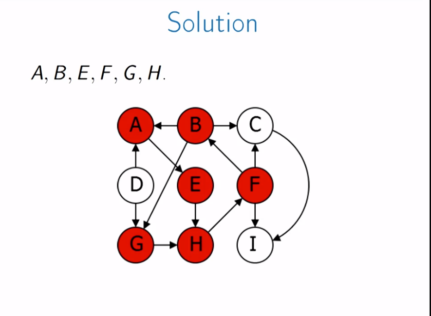
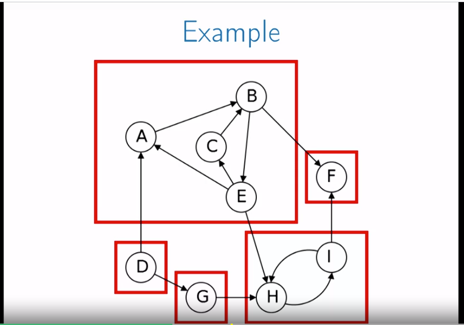
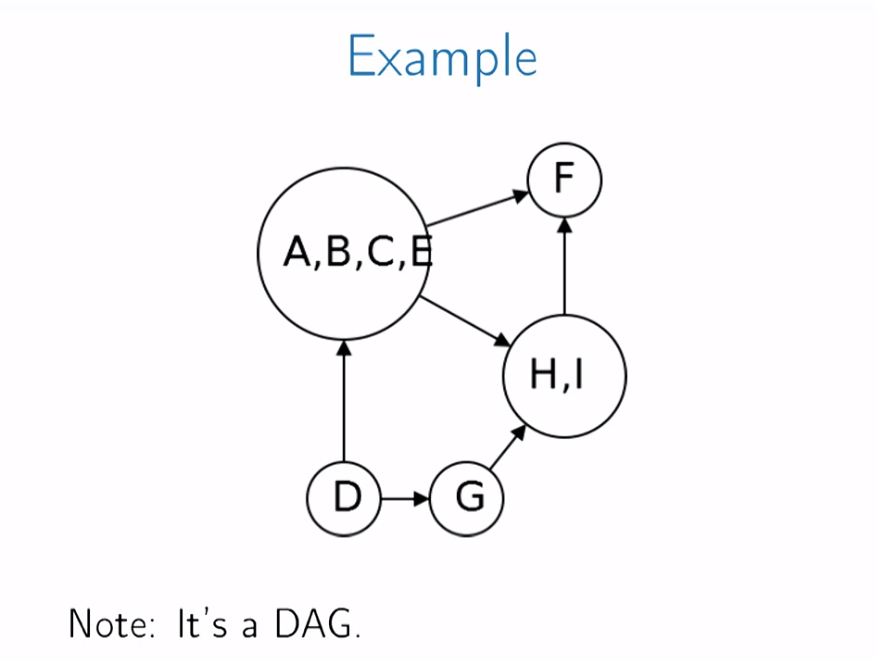
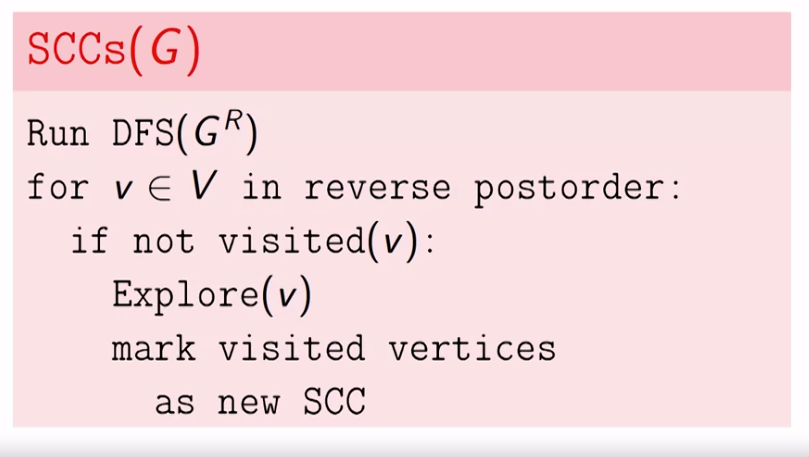

# Tuần 2 của khóa học graph

**Xét đồ thị có hướng**
## Directed acyclic graph (DAG)
Đồ thị không chu trình có hướng là đồ thị không khép kín (no cycles) - bất kỳ mọi đường từ u->v không tồn tại v->u

Thay đổi giải thuật DFS 1 chút
```
<!-- DFS -->
for all v in V: mark v unvisited
for v in V:
    if not visited(v):
        Explore(v) # hàm Explore() bên trên
    else:
        return 'Not DAG' # tại đây dùng giải thuật DFS. Thay vì bỏ qua khi xét tới 1 đỉnh đã được thăm thì đỉnh này đc xét là 1 chu trình khép kín từ u <-> v. explore(u) -> v rồi explore(v) -> u.
```

## Topological Sort
Bất kỳ 1 đồ thị ko chu trình nào cũng có thể biểu diễn ra được 1 topological sort 
Từ đồ thị dùng DFS để lấy ra các đỉnh [v1,v2,v3,...] với post(i) > post(j) khi i < j.
Remind: post() thể hiện thứ tự quay về khi duyệt DFS
post(i) > post(j) i< j. nghĩa là đỉnh i xuất hiện trước sẽ đc quay về sau.

=> Với mọi u đi được tới v thì u luôn nằm trước v

*TODO cần có code - Hint: sử dụng pre-post sau đó viết theo thứ tự post là đc. post(u) = 2 , post(v) = 5 -> v,...,u,*

*Preference:* https://iq.opengenus.org/topological-sorting-dfs/

## Strong connected components (SCC)
> Thành phần liên thông mạnh (tiếng Việt)

**Khái niệm:** thành phần liên thông mạnh là 1 phần của đồ thị mà mọi đỉnh có thể đi qua nhau (với mọi u,v có path(u->v) và path(v->u))



Xét 1 đồ thị với các SCC


Nhóm các SCC lại ta được 1 DAG


Khi các SCC được gom lại ta được metagraph
=> **Theorem**:  Mọi metagraph (đồ thị G khi coi mọi SCC là 1 điểm) đều là DAG. 1 metagraph thể hiện các thành phần SCC liên kết thế nào với nhau

**Theorem:**  với C, C' là 2 SCC với 1 cạnh đi từ C -> C' thì max_post(C) > max_post(C'). Dễ hiểu hơn thì có 2 điểm C, C' và edge CC' thì khi trình tự duyệt DFS sẽ là C->C'->..->C'->C

**Sink component:** là component chỉ có chiều đến (incoming), không có chiều đi (outwards)

**Source component:** là component có chiều đi ko có chiều đến (đang xét component là 1 SCC)

*Vấn đề*: tìm sink component của G

Xét GR (graph reverse) của G với mọi hướng của G sẽ đảo ngược lại tại GR.
GR sẽ có SCC hệt như G nhưng source component sẽ thành sink component và ngược lại. Source component sẽ có post lớn nhất -> tìm ra source của GR sẽ chính là sink của G

```
Giải thuật cơ bản
<!-- Tìm các SCC có trong đồ thị SCCs()-->
DFS(GR)
v = max_post(GR)  # max_post của GR chính là source component GR nghĩa là sink component của G
Explore(v) # v thuộc sink component nên explore() sẽ ra những node thuộc sink component đó
vertices found are fist SCC. (visited[v] = True)
Remove from G and repeat
```

```
Giải thuật hiệu quả hơn
SCCs()
DFS(GR)
for v in V in reverse postorder:
    if not visited(v):
        explore(v)
        mark visited vertices as new SCC
# Ý tưởng là DFS(GR) -> max_post(v) là source GR -> sink của G.
Duyệt từ max_post(v) đổ lại thì sẽ lần lượt ra sink G nghĩa là 1 SCC. Đánh dấu duyệt rổi nên sẽ ko cần xóa vertex đi.
Ví dụ GR có post là [[10,9,8],[7,6],[5,4]] (nếu quá khó hiểu thì tham khảo)
-> G sẽ là [[5,4],[7,6],[10,9,8]] theo thứ tự sẽ là source -> sink. Explore điểm cuối 8 sẽ ra đc 10,9 là 1 SCC. sau đó tới 6 sẽ explore đc 7, sẽ ko tới 10,9,8 vì visited=True. Ngược dần sẽ ra đc toàn bộ SCCs
* Ý tưởng: sink của GR là vùng trũng nhất nhưng khi lật ngược lại thì nó sẽ trở thành nguồn vì ko có incoming component. -> DFS khi duyệt sẽ trả về post lớn nhất tại component đó.
Chứng minh source luôn là phần có chứa max_post(). Giả sử duyệt từ source thì sau khi đi qua các phần sẽ quay lại đúng điểm ban đầu (1 lần duyệt). Nếu duyệt từ bất kì 1 điểm nào khác source. Mọi component đứng sau nó sẽ được duyệt rồi for v in V của DFS() sẽ tiếp tục, khi đó post sẽ chắc chắn lớn hơn phần đã được duyệt
VÍ dụ: A->B->C
Nếu từ A ta có A -> B -> C->C->B->A(clock=6=post)
Nếu 2 lần từ B rồi mới A
B->C->C->B (clock = 4)
A->A (clock=6=post)
```
