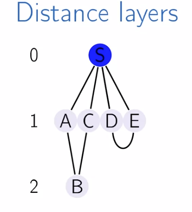
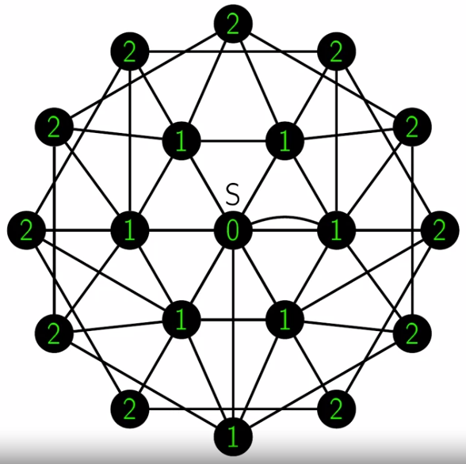
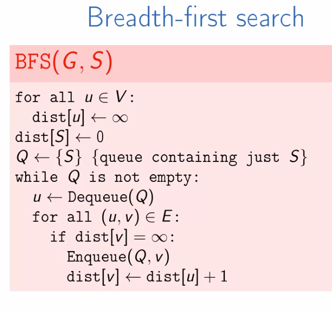
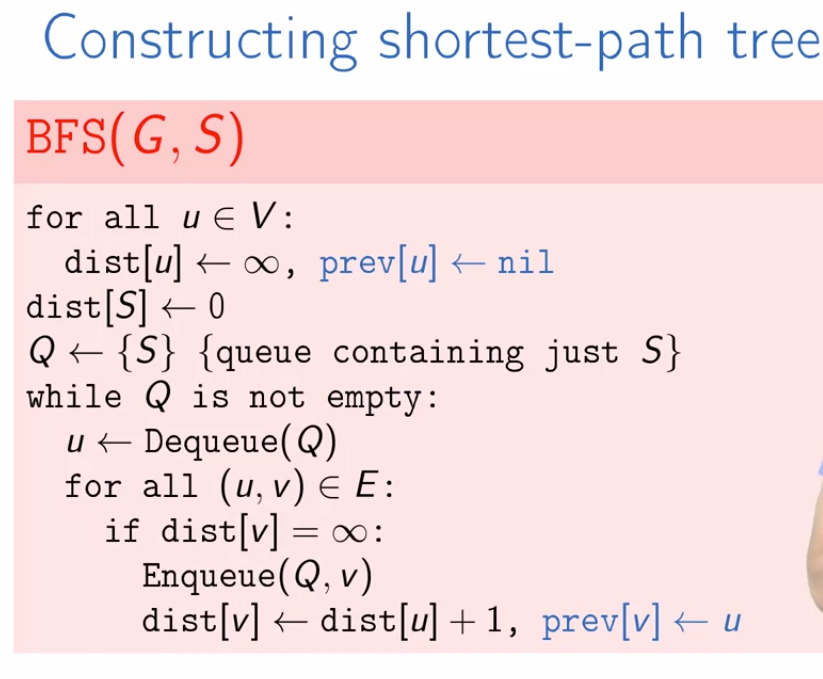

# Tuần 3 
https://www.coursera.org/learn/algorithms-on-graphs/lecture/aFOY9/most-direct-route

## Tìm đường đi ngắn nhất

### Layer


Hình ảnh thể hiện việc biểu thị đồ thị thông qua layer. Xét starting node là root node

### Breadth-First Search (BFS)
> Thuật toán tìm kiếm theo chiều rộng



### Thuật toán BFS



```
<!-- BFS -->
for all u in V:
    dist[u] = inf
dist[s] = 0
Q = {S} # queue khởi tạo chỉ gồm node S
while Q is not empty:
    u = Dequeue(Q) # lấy ra phần tử đầu tiên trong Q
    for all(u,v) in E:
        if dist[v] = inf # chưa duyệt (layer ngoài so với layer đã duyệ):
            Enqueue(Q,v) # thêm vào hàng đợi
            dist[v] = dist[u] + 1 # v sẽ ở layer bên ngoài 1 đơn vị so với layer của u. Nếu u và v cùng layer thì trong 1 lần for thì v cũng đã được duyệt
```
> BFS sẽ dùng queue để lưu các node cần xử lý First In First Out (FIFO) . Còn DFS xử lý luôn thì sẽ dùng đệ quy (stack chỉ có 1 phần tử)

**Độ phức tạp**

BFS có độ phức tạp **O(|E| + |V|)**
Xét cấu trúc lưu graph
```python
{
    1: [2,3,4], # các đỉnh liền kề với 1,
    2: [4],
    3: [],
    4: [1]
}
```
Thuật toán BFS sẽ duyệt qua các đỉnh (|E|) (hàm Enqueue - mỗi đỉnh sẽ được xét đúng 1 lần) và đi vào các phần tử liền kể với đỉnh (|V|) (for all (u,v) in E ví dụ u =1 thì v = 2,3,4 -> mỗi cạnh xét đúng 1 lần)

**BFS - shortest path tree**


Tại đây có thêm đánh dấu xem thứ tự các node được visit. prev[v] = u => node u is parent of v

Còn 1 bước nữa từ các biến có được từ BFS() dựng lại cây (ko xem)
## Đang xem dở
https://www.coursera.org/learn/algorithms-on-graphs/lecture/X7NUe/shortest-path-tree