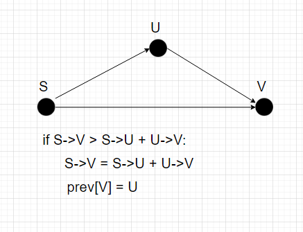
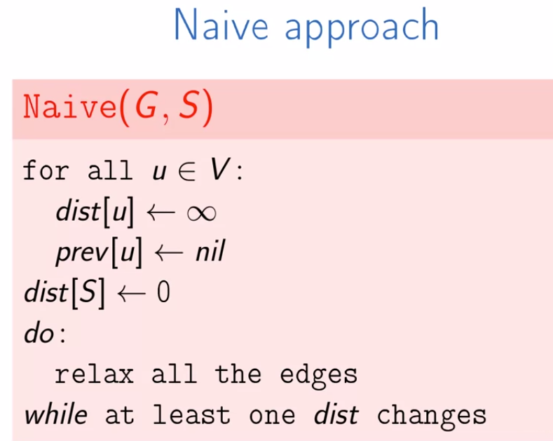
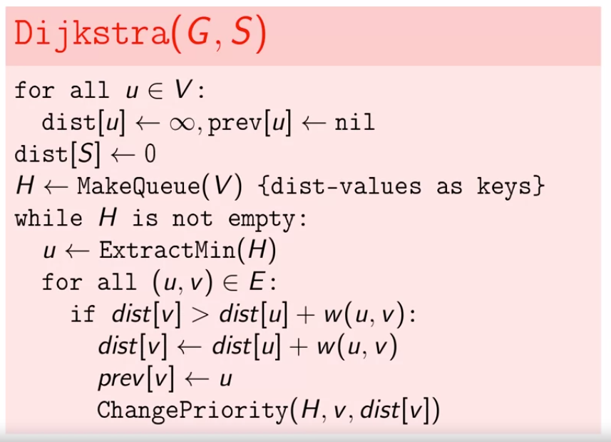
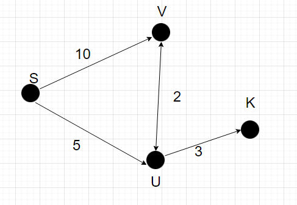

# Đồ thị có trọng số (weighted graph)

## Shortest path (đường đi ngắn nhất)

Sử dụng công thức trên ta có cách tiếp cận đầu tiên cho việc tìm đường đi ngắn nhất cho 2 điểm bất kỳ trong đồ thị (ko có nhiều ý nghĩa1)

**Thuật toán Dijkstra**

B1: Khởi tạo mọi khoảng cách dist[inf, inf, ..]
    sptSet = [False,...] đánh dấu mọi đỉnh chưa được xét
    Khoảng cách dist[source] = 0 # dist(source->source) = 0
B2: For i in range(len(V))
Tại đây vòng for tương ứng với while H is not empty. Nhưng với mỗi vòng lặp sẽ thực hiện việc xử lý 1 vertex (node) nên vòng lặp sẽ tương đương với range(len(V))
B3: Lấy ra node đang có khoảng cách nhỏ nhất chưa được xử lý
* Lưu ý: xét thời điểm ban đầu. S (source) bắt đầu được xử lý thì mọi neighbour của nó sẽ dược tính khoảng cách -> khi lấy ra node có khoảng cách nhỏ nhất node đó mới chuẩn bị được xử lý
-> node đó thỏa mãn là min(dist) và sptSet[node] = False

Xét tại đây
sptSet (visited) sẽ bao gồm S và khi đó V, U đã dược tính khoảng cách sẵn. Node có dist nhỏ nhất mà chưa visited là U (V,U - node chưa thăm = Graph - Visited). min_distance_node = U.
Lấy ra các hàng xóm chưa thăm của U ta có V, K (S là hàng xóm nhưng thăm rồi).
For vertex in (V,K):
    SV + VU > SU -> ignore
    SU(5) + UK(3) < SK (inf) => SK = SU + UK
-> In ra khoảng cách của điểm cần tìm là xong.
Chú thích:
* sptSet: shortest path tree set

> Thêm giá trị prev vào là sẽ in ra được đường đi ngắn nhất

## Currency Exchange

**Bài toán:**
Có các loại tiền (USD, VND, YEN, ....) và tỉ giá của chúng. Từ 100 USD có thể đổi ra được tối đa bao nhiêu VND.

-> Nếu xét mỗi loại tiền là 1 node thì trọng số giữa 2 node sẽ là tỉ giá. Cần tìm 1 đường đi từ source->target sao cho tích hệ số là lớn nhất

Xét **log(ab) = log(a) + log(b)**

-> cần tính log(e1) + log(e2) + ... với e là cạnh đi qua. Thay đổi phần duyệt đồ thị tính tổng các trọng số thì giờ tính tổng các log của trọng số. Tổng log(e1) + log(e2) + .. lớn nhất tương đương với âm của chúng nhỏ nhất -> tìm đường đi ngắn nhất với hệ số là -log(e) với e là tỉ lệ chuyển đổi

**Nếu**: tìm được 1 chu trình mà a->b->c->a mà a trước < a sau (1 a trước đc n a sau n>1) thì ta sẽ có 1 quy trình đổi tiền luôn có lợi và tiền tự tăng

## Đang xem dở
https://www.coursera.org/learn/algorithms-on-graphs/lecture/22cu6/bellman-ford-algorithm