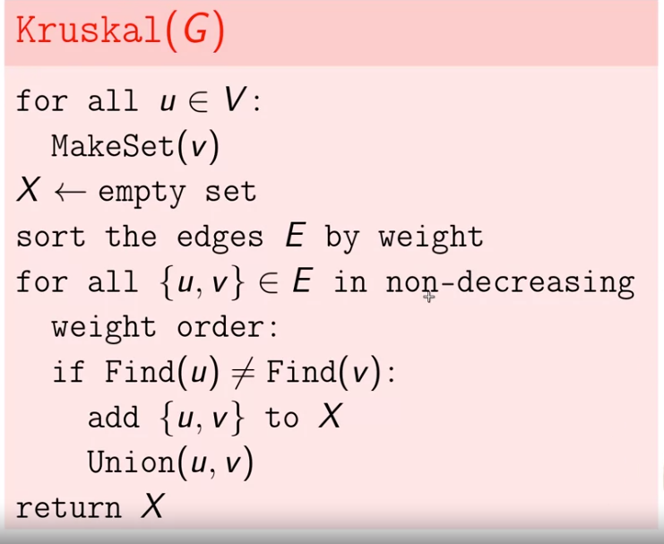

## Minimun spanning tree (MST)

**Vấn đề**

Cho 1 đồ thị G có trọng số. Tìm ra đồ thị con G' nằm trong G sao cho đồ thị vẫn được kết nối (có đường đi từ mọi đỉnh tới nhau và tổng độ dài cạnh là nhỏ nhất)

-> Đồ thị G là 1 MST. Gọi là tree bởi nó vô hướng và không có chu trình, mọi đỉnh được kết nối

**Nhắc lại về tree**
- Là 1 đồ thị vô hướng, connected, acyclic
- is a tree which has n-1 edges, n verticies
- Mọi đồ thị connected G(V,E) có E = V-1 đều là tree
- Có 1 đường đi duy nhất từ đỉnh này tới đỉnh khác

### Thuật toán tìm cây

**Kruskal's algorithm:** thuật toán khởi tạo rỗng **Gr** sau đó thêm liên tục các cạnh vào đồ thị nếu nó không tạo ra chu trình.

-> For (u,v,w) in E

-> Cạnh đang duyệt ko tạo ra chu trình khi và chỉ khi 2 đỉnh đó chưa cùng tồn tại trong đồ thị **Gr**

**Prim's algorithm:**  thuật toán bắt đầu bằng 1 node bất kỳ, thêm 1 đỉnh mới có giá trị cạnh nhỏ nhất (cạnh có 1 đỉnh mới và 1 đinh đã có)

-> considering_edges = list of (u,v) if (u in Gr and v not in Gr) or (u not in Gr and v in Gr)

