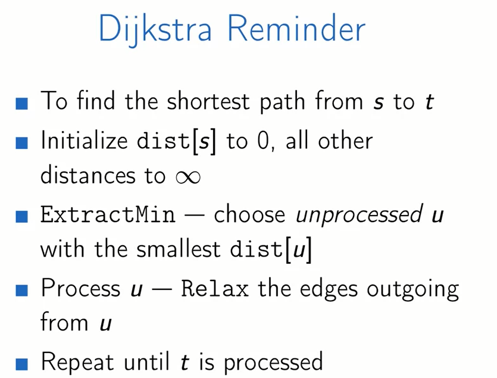
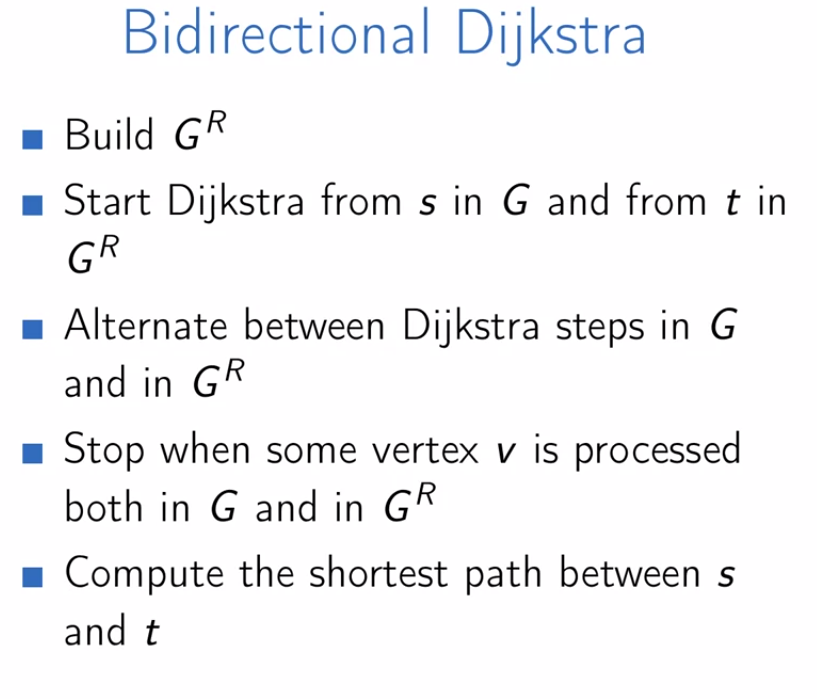
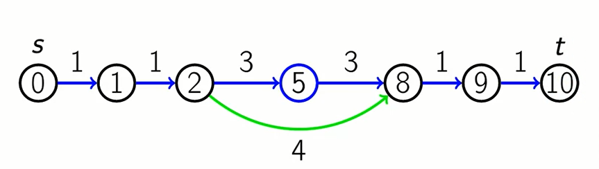

## Bidirectional search -> bidirectional dijkstra algorithm

**Vấn đề:** Tìm đường đi ngắn nhất từ s->t

Thuật toán Dijkstra sẽ dùng BFS() để tính toán dần đường đi của vòng tròn xung quanh điểm s (layer) cho tới khi chạm tới điểm t

**Thuật toán bidirectional dijkstra algorithm**

Xét trường hợp sau:

Đường đi ngắn nhất từ s tới t có thể không đi qua meeting point. Xét node khoanh tròn 2,5,8. Từ node 2, xét node 5 trước vì (2->5) 3 < 4 (2->8). Từ 8 tới 5 cũng tương tự.

**=>** khoảng cách ngắn nhất vẫn đi qua node 5. Lấy min qua meeting point là đc. Như hình trên 
shortest distance = min(s->2+ 2->8 + 8->10, s->5+5->10)

=================================================

## A* algorithm (A star)