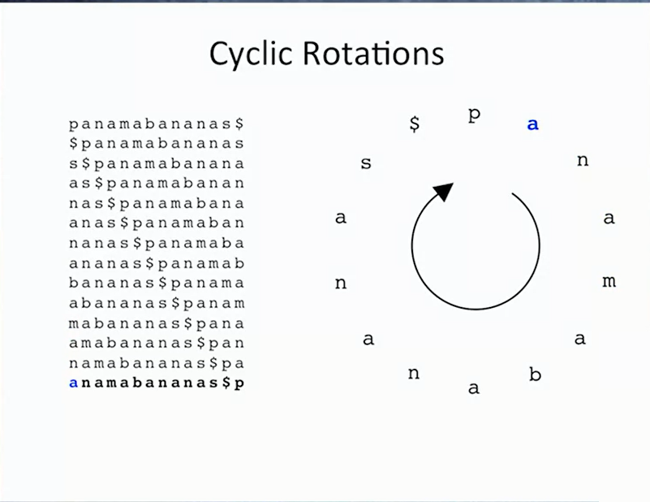
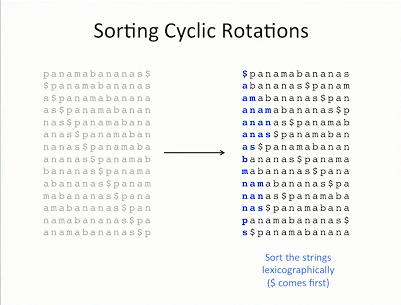
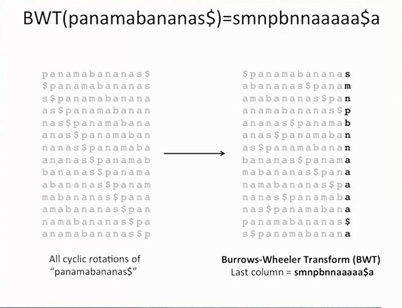

# Burrows-Wheeler Transform
>for text compression

## Run-length encoding

```
AAABBBBCC
= 3A4B2C
```

## Burrows-Wheeler Transform (BWT)

**Vấn đề:** 1 xâu bình thường ko có nhiều kí tự trùng nhau như thế.

**Ý tưởng:** sử dụng 1 transform để chuyển đổi xâu về dạng có nhiều kí tự liền nhau rồi dùng **run-length encoding** để encode

```
ABCAABCD 
=> A..AB..BC..CD..D (transform) 
=> ?A?B?C?D (run-length encoding)
```

Xét xâu: panamabanana$ ($ đánh dấu cuối xâu đã nói ở week 1)

**B1** tạo các rotation


**B2:** sắp xếp các rotations trên theo thứ tự từ điển với $ coi là đứng trước a


**B3:** lấy các kí tự cuối của mảng đã được sắp xếp ta được xâu đã chuyển đổi và dễ dàng nén



### Invert bwt

Transform (encode)
```
banana$
-> 
banana$           $banana
anana$b           a$banan
nana$ba  sorting  ana$ban
ana$ban  ======>  anana$b
na$bana           banana$ 
a$banan           na$bana 
$banana           nana$ba
-> annb$aa
```

Invert (decode)
```
a       $ (1st col)   a$      $b        a$b
n       a             na      a$        na$
n sort  a merge       na sort an merge  nan
b ====> a =========>  ba ===> an =====> ban =>(sort+merge) n lần sẽ ra ma trận ban đầu
$       b             $b      ba        $ba
a       n             an      na        ana
a       n             an      na        ana
```
**Độ phức tạp:**

Sắp xếp mảng các text: |text|log|text|.

Các thao tác merge sẽ tốn 1+2+...+|text| = O(|text|^2)

Độ phức tạp = |text|^3 *log|text|

### **Invert bwt improvement**

Chưa hiểu được

* https://www.coursera.org/learn/algorithms-on-strings/lecture/C0opC/inverting-burrows-wheeler-transform
* https://www.geeksforgeeks.org/inverting-burrows-wheeler-transform/
