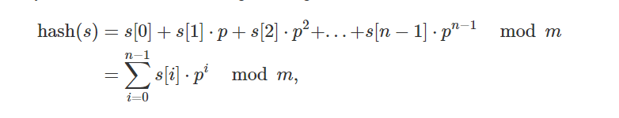

# String hashing

## Công thức

**polynomial rolling hash function**


Công thức sẽ tính số mũ tương ứng với index của char đó có trong string.   
**p = 31 hoặc 53** tùy vào số kí tự cho phép trong string.  
**m = 1e9+9**. Các số được chọn đều là **số nguyên tố**

### Tại sao  
Nếu không sử dụng p^n. 1 string ab và ba sẽ có cùng 1 hash string.  
Nếu các số m, p không là số nguyên tố thì p%2. m%2 (và có thể còn các ước khác 2) và khi đó không gian hash nhỏ lại. hash collide dễ xảy ra hơn.  
Nếu không chia mod m thì số sẽ quá to khi đó so sánh sẽ mất O(N) với N là độ dài số

```c++
// Mẫu
long long compute_hash(string const& s) {
    const int p = 31;
    const int m = 1e9 + 9;
    long long hash_value = 0;
    long long p_pow = 1;
    for (char c : s) {
        hash_value = (hash_value + (c - 'a' + 1) * p_pow) % m;
        p_pow = (p_pow * p) % m;
    }
    return hash_value;
}
// Precomputing the powers of p might give a performance boost.
```

```c++
// Tự viết
long long compute_hash(string s){
	long long mod = 1e9+9;
	long long p = 1;
	long long hash_value = 0;
	long long factor = 31;
	for (int i=0;i<s.size();i++){
		ll v = s[i] - 'a' + 1; // a có giá trị 1 -> ... z = 26
		hash_value = (hash_value + v*p) % mod;
		p = (p * factor) % mod;
	}
	return hash_value;
}
```

```c++
vector<ll> power;
vector<ll> prefix_hash;
void pre_compute(int length){
    // Tính trước pow(p, n)
    int factor = 31;
    ll p=1;
    for (int i=0;i<length;i++){
        power.push_back(p);
        p = (p* factor) % mod;
    }
}

long long compute_hash(string s){
    ll mod = 1e9+9;
    ll hash_value = 0;
    for (int i=0;i<s.size();i++){
        ll v = s[i] - 'a' +1;
        hash_value = (hash_value + v* power[i]) % mod;
    }
    return hash_value;
}
void compute_prefix_hash(string s){
    for (int i=1;i<=s.size();i++){
        string sub = s.substr(0,i);
        prefix_hash.push_back(compute_hash(sub));
    }
}

bool is_equal(string s, int i, int j, int u, int v){
    // So sánh 2 sub string
    assert(j-i==v-u);
    int p1, p2;
    if (i==0) p1 = prefix_hash[j];
        else p1 = prefix_hash[j] - prefix_hash[i-1];
    if (u==0) p2 = prefix_hash[v];
        else p2 = prefix_hash[v] - prefix_hash[u-1];
    if (p1<0) p1+=mod;
    if (p2<0) p2+=mod;
    return (p1*power[v-j]) % mod == p2;
}
```