## Vấn đề
Có string dài 10^9 kí tự và 10^12 pattern. Làm sao để match các pattern đó trong thời gian giới hạn.

## Naive solution:

### Mã giả
```
for string in strings:
    for pattern in patterns:
        if match(pattern, string):
            print(pattern, string)
```
### Complexity
**O(|len(strings)| * |len(patterns)|)**
## First improvement:

### Trie creation

Dựng 1 trie (tree) rẽ nhánh cho các pattern

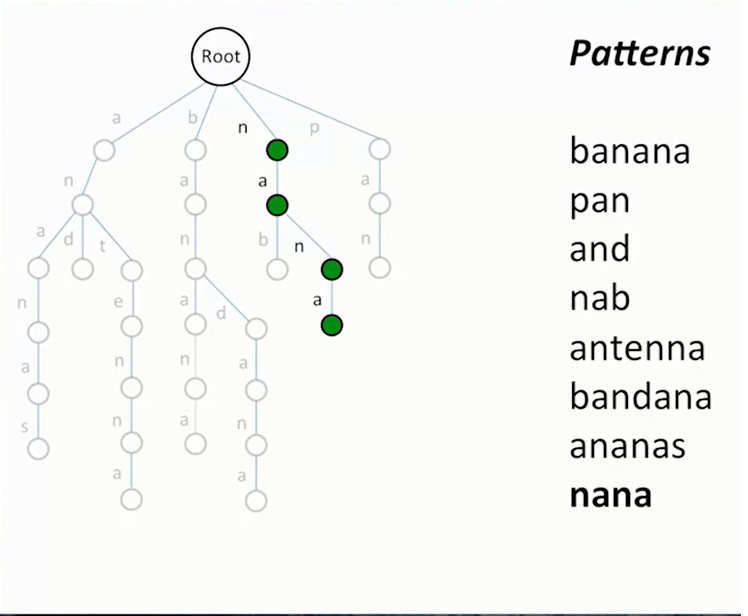

Theo hình trên từ điểm đầu tới các node lá (leaf) sẽ là 1 pattern

### Pattern matching

Cho các string chạy lần lượt qua cây. Nếu nó đạt tới nút lá thì match. Ko thì là ko match.

### Đánh giá độ phức tạp

**O(|len(strings)| * |longest pattern|)**

Nhận xét: độ phức tạp từ ***len(patterns)*** đã chuyển thành ***longest pattern***

## Second improvement

### Chuyển text sang thành trie

Cách làm: dựng lần lượt cành cho string với 1 con trỏ chạy từ đầu tới cuối s[i:] với i=0..n

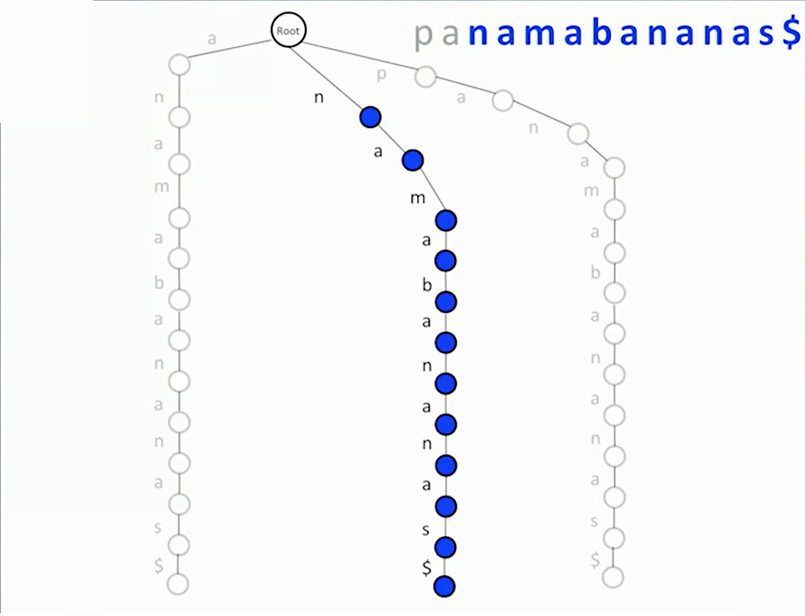

Suffix trie of text
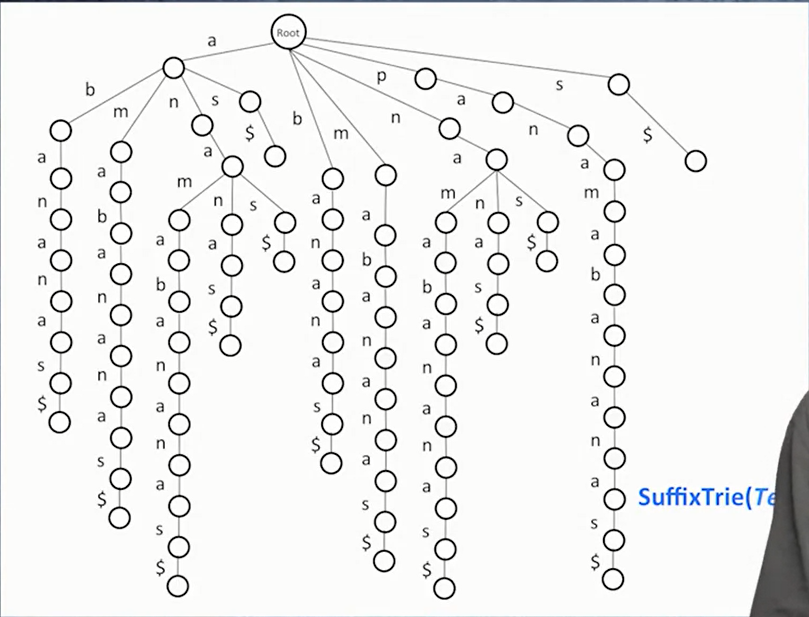

Ví dụ:

string = "abcca" thì sẽ dựng cây cho abcca, bcca, cca, ca, a

Pattern là chiếc ô tô
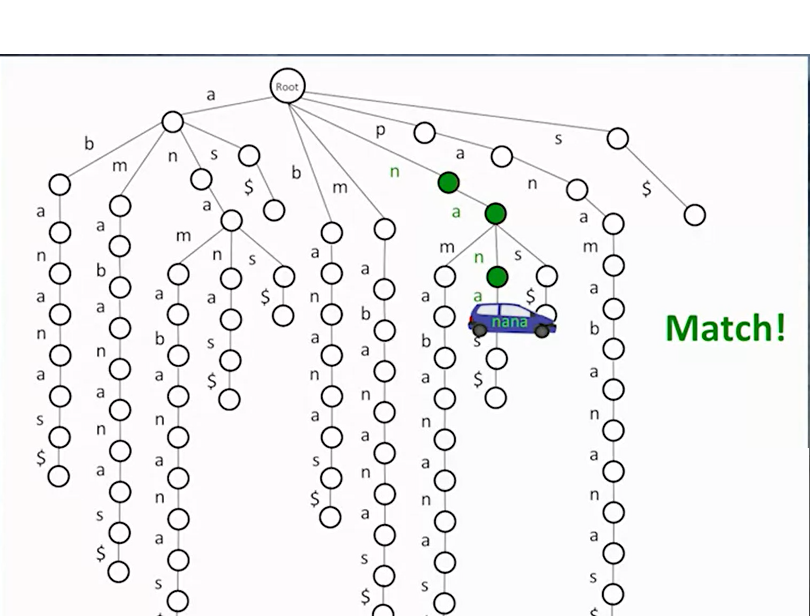

Không match khi không tìm thấy node có giá trị tương ứng đang xét nữa 
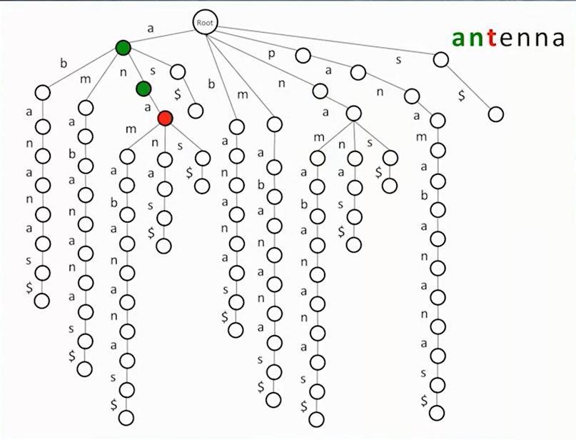

Sau khi match, để biết pattern đã match ở vị trí thứ bao nhiêu, đơn giản thêm 1 giá trị cho mỗi node lá

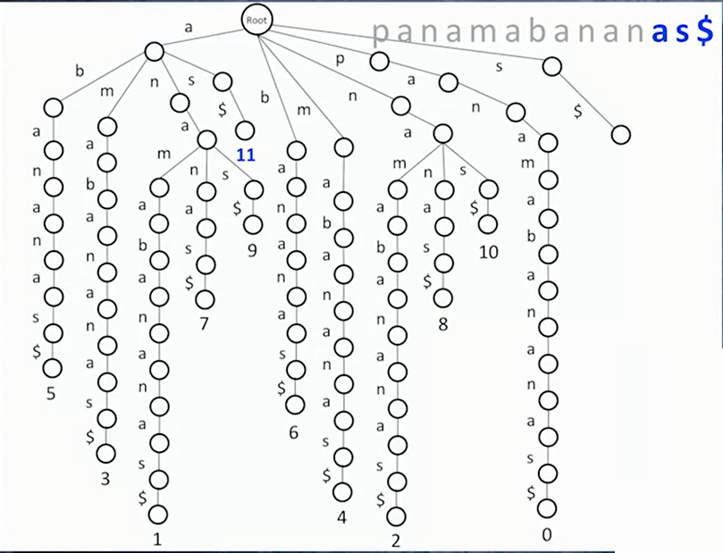

Từ vị trí match duyệt tới cuối cây sẽ ra những vị trí pattern xuất hiện trong string ban đầu.

Ví dụ tại cây trên. Xét pattern **na**. Từ **n**->**a** ta sẽ có 3 nhánh. Duyệt tới tận cùng 3 nhanh đó ta được vị trí 2,8,10. Vì pattern ngắn hơn nên ở first improvement, một string match khi nó chạm tới lá ngoài cùng

### Bộ nhớ của suffix trie
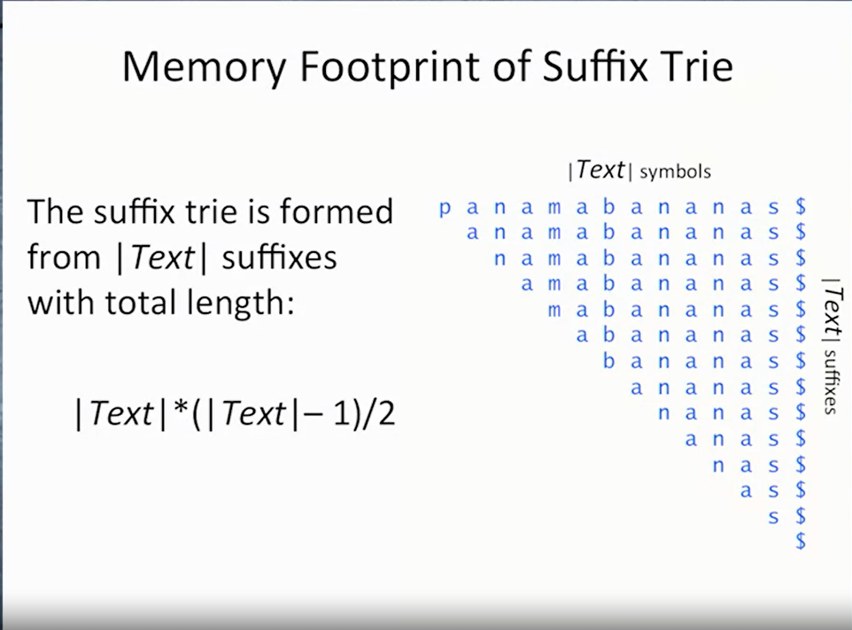

Nhận xét: với string 10^9 kí tự thì bộ nhớ lưu trữ cây sẽ là 10^18. 

*Should they give up?*

## Suffix trie -> suffix tree

Các cành không có nhánh sẽ được gộp vào thành 1 string. Ta được **suffix tree**

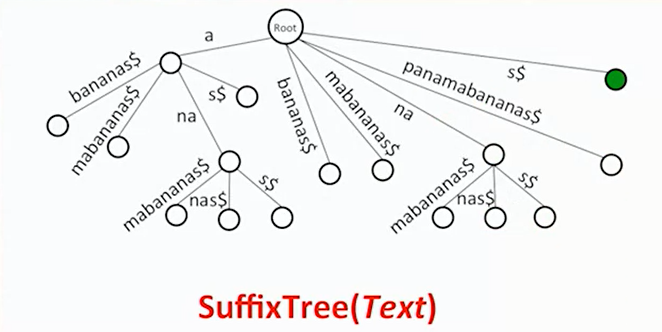

Lưu cây dữ liệu, do string quá dài ví dụ banana$ có thể chuyển thành start,end đánh dấu vị trí của banana$ trong string ban đầu

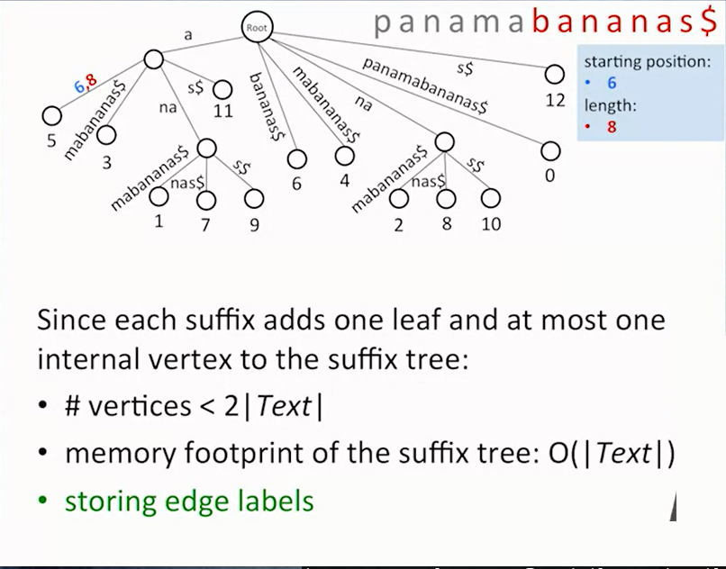

Toàn bộ tree sẽ có dạng

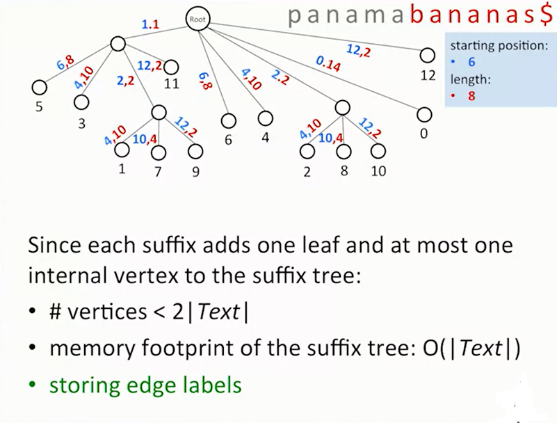

** Về dấu $

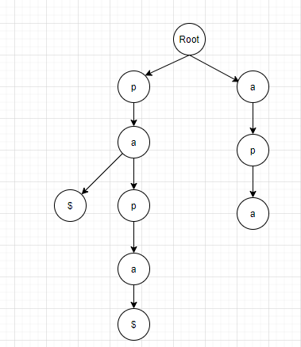
Xét string papa, nếu ko có $ thì khi dựng pa thứ 2 sẽ bị lẫn vào trong papa nên cần $ để tách nó thành 1 lá

### Đánh giá
(quadratic runtime)

Thời gian xây dựng suffix tree tốn O(|Text|) và thời gian so sánh pattern với text sẽ tốn O(|pattern|). Tổng là O(|Text| + |Pattern|)

Bộ nhớ: O(|Text|) vì chỉ có text dựng cây, còn pattern sẽ chạy qua cây chứ ko lưu trữ

**Vấn đề mở:**

Multiple pattern matching: tại đây mình chờ đợi 1 cách làm để hợp nhất 2 cái cây ở first improvement và second improvement nhưng ko có. Khóa học để mở vấn đề -> cần nghiên cứu thêm.

### TODO:
* cài đặt suffix tree
* tìm hiểu multiple pattern matching