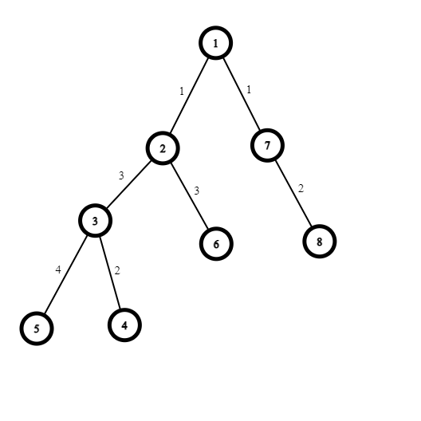

# Heavy light decomposition

> TODO: thêm template \<class T\>.

## Giới thiệu chung

Bằng việc chia nhỏ cây thành các đoạn nhỏ. Ta có thể

* Tính khoảng cách giữa 2 node bất kỳ trên cây
* Tính k-th ancestor của 1 node bất kỳ trên cây
* Dựa vào segmentree có thể tính toán max, min, sum, .. của các node trên path(u->v). Path(u->v) tạo ra 1 array, có thể query trên đoạn đó với segmentree có trên cây

### Giải thích thuật toán
    
  

Trên 1 cây bất kỳ, gọi sub(v) là số node con của đỉnh v. Ví dụ node 1 có sub(1) = 4 (node 4, 5, 8, 9)  
Trong các con {u} của đỉnh v, đỉnh nào có sub(u) >= sub(v)/2 thì đó là **heavy vertex**, **uv** gọi là **heavy edge**.  
Xét điểm 0, có con là {1, 2, 3}. 
* sub(0) = 15
* sub(1) = 4
* sub(2) = 8
* sub(3) = 0.  
sub(2) >= sub(0)/2 nên `2 là heavy vertex`, `0->2 là heavy edge`.  
Tương tự như thế ta sẽ được cây như hình bên trên, cạnh dày chính là **heavy**  
Sau bước **decomposition** (lấy code theo như cp-algorithm) sẽ tới phần `builSegtree`.    
Tại đây cây đã được chia nhỏ thành các đoạn nhỏ hơn, tạm gọi là **khối**. Các khối bao gồm các đoạn thẳng - debug các biến có trong phần khởi tạo để xem lại cách tổ chức dữ liệu.  
Bởi vì khi này cây trở thành các đoạn thẳng, coi các đoạn đó là các mảng, dựng `segmenttree` lên toàn bộ các mảng đó ta có thể query trên cây.  
Thuật toán tại template dựng 1 segment tree trên toàn bộ cây để tối ưu hơn.  
**Query on path**
max(u, v) = max(u, lca(u, v)), max(lca(u, v), v)  
Max(u, lca(u, v)) sẽ dùng segtree query trên từng khối.

**Xét cây dưới đây**  
  
Vấn đề: Cho cây và độ dài các cạnh, query độ dài từ đỉnh (u->v) bất kỳ.  
Cách giải: Segtree yêu cầu trọng số nằm trên các đỉnh của cây, tại đây trọng số đang nằm ở cạnh (chung của 2 đỉnh). Đẩy trọng số xuống đỉnh phía dưới.

  
Khi này trọng số sẽ nằm trên 1 đỉnh và buildSegtree trên các node như bình thường. weight(root=0) = 0.

TODO: cần 1 ví dụ thực tế từ decomposition tới việc query. + lý giải về sự hoạt động của từng hàm đã có.

## Reference
* [HLD - cp-algorithm](https://cp-algorithms.com/graph/hld.html) (đã backup tại [backup folder](/backup/tree/))

## Template
	
[HLD template](https://github.com/conlacda/noteforprofessionals/blob/master/language/C%2B%2B/snippet/hld.sublime-snippet)

## Usage

**Khởi tạo**:  
Decomposition:
```c++
vector<vector<int>> g(N); g[u].push_back(v); g[v].push_back(u);
HeavyLightDecomposition hld(adj);
```
**Build segment tree**
```c++
vector<int> w(N); // trọng số trên các đỉnh của cây. graph sẽ chỉ chứa cạnh và w này sẽ chứa weight.
                  // với weight(u, v) = weight -> uv = depth[u] > depth[v] ? u : v; w[uv] = weight; dùng for cho mọi cạnh là được
hld.buildSegTree(w);
```
**Query**  
Nhớ điều chỉnh hàm trong segmenttree
```c++
LCA lca(g);
hld.query(u, lca(u, v)); hld.query(v, lca(u, v)); // query 2 nửa rồi hợp lại. max(u, v) = max(max(u, lca(u, v)), max(v, lca(u, v)));
                                                  //                          sum(u, v) = sum(sum(u, lca(u, v)), sum(v, lca(u, v)));
```
  

Với bài toán mà nằm trên cạnh ta thấy trọng số sẽ dồn về node dưới, `query(5, 6) = query(edge(53), edge(32), edge(26)) = query(5, 3, 6) = query(5->3, 6->6)- không xuất hiện 2 là lca(5,6)`.  
Nhưng nếu trọng số nằm trên cạnh thì `query(5, 6) = query(5, 2) && query(6, 2) = query(5->2, 6->2)` và có xét tới lca(5,6)

**Kth_ancestor**
```c++
hld.kth_ancestor(u, kth);
```

**Custom query**  
Giả sử hàm query trên đoạn là hàm min(). Tìm min trên path (u->v)  
HLD **không hỗ trợ query từ 2 node bất kỳ** nên ta cần tách thành `path(u->v) = min(path(u->lca(u, v)), path(v->lca(u, v))`  
Xét 4 mục `CHANGE HERE`:  
* (1), (4) là phần cần thay đổi hàm query, ví dụ min(), max(), and(&), or(|), sum()  
* (2), (3) là phần để xác định xem đoạn nào cần được lấy.  

Xác định xem đoạn path nào cần được query.  
Xét nhánh cây `2->5->6` & `2->7`  
* Trọng số nằm trên đỉnh - Hàm max(), min(), and(&),... - hàm không bị ảnh hưởng khi 1 phần tử được tính trong 2 lần query
  `path(6, 7) = max(path(6, 2), path(7,2))`. 2 được tính trong cả path(6,2) và path(7,2) nhưng kết quả không đổi  
  => **path(u,v) = path(u, lca(u, v)) merge path(v, lca(u, v))** + **Lấy CHANGE HERE 3, bỏ CHANGE HERE 2**  

* Trọng số nằm trên đỉnh - Hàm sum(), ... - hàm ảnh hưởng khi 1 node được tính 2 lần.  
  `path(6, 7) = sum(path(6, 2), path(7, 2)) - weight[2]` - tại đây weight[2] chỉ được tính 1 lần nên phải trừ đi weight[2] do path(6,2), path(7,2) đã đếm 2 lần  
  => **path(u, v) = path(u, lca(u, v)) merge path(v, lca(u, v)) - weight[lca(u, v)]** + **Lấy CHANGE HERE 3, bỏ CHANGE HERE 2**  

* Trọng số nằm trên cạnh - trọng số nằm trên cạnh sẽ được chuyển xuống node bên dưới. Do đó khi query luôn bỏ ra node lca(u,v) vì node đó chứa trọng số của nó với đỉnh bên trên, không nằm trên path(u->v) - **lấy phần CHANGE HERE 2 và loại bỏ CHANGE HERE 3**
 

**Tham số cần quan tâm**
* pos[]: trong quá trình build segment tree, cây sau khi được decomposition sẽ được ghép từng đoạn vào thành 1 mảng rồi dựng segment tree trên mảng đó. pos[] sẽ ánh xạ chỉ số node vào với index trong segment tree.  
  `pos[node] = segtree_index`.  
  `seg->set_val(pos[node], val)` khi muốn cập nhật weight của node.

## Lưu ý

	
## Verifications

<details>
  <summary>QTREE</summary>

```c++
// https://www.spoj.com/status/QTREE,hoanglongvn/
#include<bits/stdc++.h>
 
typedef long long ll;
const ll mod = 1e9 + 7;
#define ld long double
 
using namespace std;
 
<LCA-snippet>
<HLD-snippet>
void solve(){
    int n;
    cin >> n;
    vector<vector<int>> adj(n);
    vector<vector<pair<int,int>>> adj_w(n);
    vector<pair<int,int>> seq;
    for (int i=0;i<n-1;i++){
        int u, v, w;
        cin >> u>>v>>w; u--; v--;
        adj[u].push_back(v); adj[v].push_back(u);
        adj_w[u].push_back({v, w}); adj_w[v].push_back({u, w});
        seq.push_back({u, v});
    }
    LCA lca(adj);
    vector<ll> height = lca.height();
    HeavyLightDecomposition hld(adj);
    vector<int> weight(n, -1);
    for (int i=0;i<adj_w.size();i++){
        for (auto vw: adj_w[i]){
            int v = vw.first, w = vw.second;
            if (height[i] > height[v]) weight[i] = w;
            else weight[v] = w;
        }
    }
    hld.buildSegTree(weight);
    // Query
    while (true){
        string s; 
        cin >> s;
        if (s == "DONE") return;
        int u, v; cin >> u >> v; u--;
        if (s == "QUERY"){
            v--;
            int p = lca.lca(u, v);
            cout << max(hld.query(u, p), hld.query(v, p)) <<'\n';
        }
        else {
            // Update
            int p1 = seq[u].first;
            int p2 = seq[u].second;
            if (height[p1] > height[p2]){
                hld.set_val(p1, v);
            }
            else hld.set_val(p2, v);
        }
    }
}
int main(){
    ios::sync_with_stdio(0);
    cin.tie(0);
    #ifdef DEBUG
        freopen("inp.txt", "r", stdin);
        freopen("out.txt", "w", stdout);
    #endif
    int N;
    cin >> N;
    while (N--) solve();
} 
```
</details>
    
<details>
  <summary>Path Queries II- CSES</summary>

```c++
// https://cses.fi/problemset/task/2134/
#include<bits/stdc++.h>
 
typedef long long ll;
const ll mod = 1e9 + 7;
#define ld long double
 
using namespace std;
 
#ifdef DEBUG
#include "debug.cpp"
#else
#define dbg(...)
#endif
<LCA-snippet>
<HLD-snippet>
int main(){
    ios::sync_with_stdio(0); cin.tie(0);
    int N, q;
    cin >> N >> q;
    vector<int> w(N);
    for (int i=0;i<N;i++) cin >> w[i];
    vector<vector<int>> adj(N);
    for (int i=0;i<N-1;i++){
        int u, v;
        cin >> u>>v; u--; v--;
        adj[u].push_back(v);
        adj[v].push_back(u);
    }
    HeavyLightDecomposition hld(adj);
    hld.buildSegTree(w);
    LCA lca(adj);
    // Query
    for (int i=0;i<q;i++){
        int t, u, v;
        cin >> t >> u>>v; 
 
        if (t == 2) {
            u--;v--;
            // Query u->LCA(u), v->LCA(v);
            int p = lca.lca(u, v);
            // cout << u<< ' '<<v<< ' '<< lca.lca(u, v) << '\n';
            // Lấy ra path từ u->lca, v->lca
 
            cout << max(hld.query(u, p), hld.query(v, p)) << ' ';
        } else {
            // t == 1
            // Update value
            u--;
            hld.seg->set_val(hld.pos[u] , v);
        }
    }
    cerr << "Time : " << (double)clock() / (double)CLOCKS_PER_SEC << "s\n";
}
```
</details>  

<details>
  <summary>CSES - New Roads Queries</summary>

```c++
// https://cses.fi/problemset/task/2101/
#include<bits/stdc++.h>
 
typedef long long ll;
const ll mod = 1e9 + 7;
#define ld long double
 
using namespace std;
 
#ifdef DEBUG
#include "debug.cpp"
#else
#define dbg(...)
#endif
 
<DSU-snippet>
<LCA-snippet>
<HLD-snippet>
int main(){
    ios::sync_with_stdio(0);
    cin.tie(0);
    #ifdef DEBUG
        freopen("inp.txt", "r", stdin);
        freopen("out.txt", "w", stdout);
    #endif
    int N, r, q;
    cin >> N >> r>>q;
    DSU dsu(N);
    // Đọc vào các road
    vector<vector<int>> adj(N);
    vector<vector<pair<int,int>>> adj_w(N);
    for (int i=0;i<r;i++){
        int u, v;
        cin>>u>>v;
        u--; v--;
        if (dsu.find_set(u) != dsu.find_set(v)){
            dsu.merge_set(u, v);
            adj[u].push_back(v); adj[v].push_back(u);
            adj_w[u].push_back({v, i+1}); adj_w[v].push_back({u, i+1});
        }
    }
    // Kết nối toàn bộ dsu rời rạc vào với nhau và có trọng số INT_MAX
    int root = 0;
    for (int i=0;i<N;i++){
        if (dsu.find_set(i) != dsu.find_set(root)){
            int p = dsu.find_set(i);
            dsu.merge_set(p, root);
            adj[root].push_back(p); adj[p].push_back(root);
            adj_w[root].push_back({p, INT_MAX}); adj_w[p].push_back({root, INT_MAX});
        }
    }
    // Set up
    LCA lca(adj);
    vector<ll> height = lca.height();
    // Đẩy hết trọng số cạnh sang cho node con
    vector<int> weight(N, -1);
    for (int i=0;i<adj_w.size();i++){
        for (auto vw: adj_w[i]){
            int v = vw.first, w = vw.second;
            if (height[i] > height[v]) weight[i] = w;
            else weight[v] = w;
        }
    }
    HeavyLightDecomposition hld(adj);
    hld.buildSegTree(weight);
    // Resolve
    for (int i=0;i<q;i++){
        int u, v;
        cin >> u>>v; u--;v--;
        int p = lca.lca(u, v);
        int ans = max(hld.query(u, p), hld.query(v, p));
        if (ans == INT_MAX){
            cout << -1<<'\n';
        } else cout << ans<<'\n';
    }
    cerr << "Time : " << (double)clock() / (double)CLOCKS_PER_SEC << "s\n";
}
```
</details>
